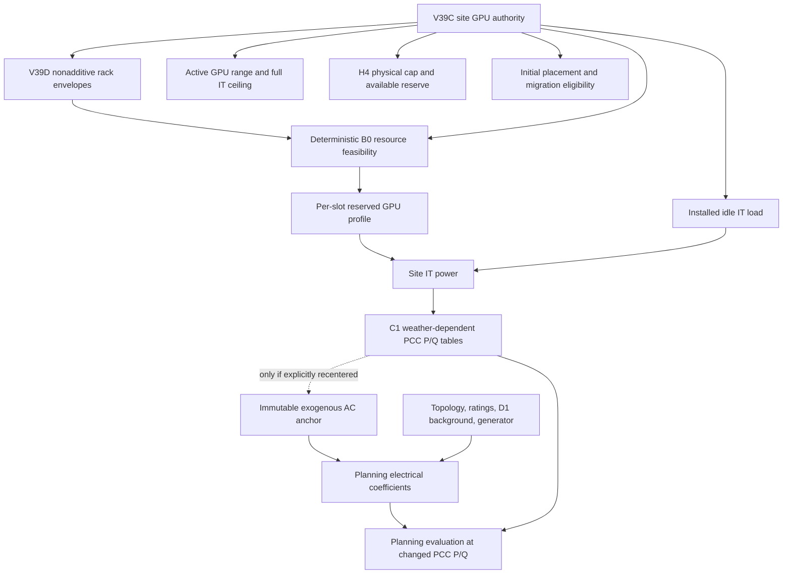

# GPU capacity dependency graph

- CASE 2: installed capacity contributes existing idle power, 104.1606964512843 W/GPU.
- Rack pools are four/site, nonadditive, not physical racks. Envelope update YES; modeled topology change NO; physical rack count unknown.
- Per-GPU power/C1 coefficients unchanged; aggregate 624-specific range and conservation authority must change.
- H4 physical cap, capped actionable reserve, power tables, B0 reference, candidate identities and eligibility require propagation.
- Electrical coefficient class A under exact unchanged exogenous anchor and generator inputs; reuse must be recertified, not relabeled as fresh generation.
- Recentered anchor means full 31-day regeneration. No generation performed in this audit.
- Capacity and baseline do not directly enter existing electrical coefficient arithmetic; they do enter the context power tables after coefficients.
- Current PCC: 500 kVA and 208.179183602 A per AIDC transformer phase, plus shared network constraints.

Exact file/line/hash dependencies are in GPU_CAPACITY_DEPENDENCY_AUDIT.json and ELECTRICAL_COEFFICIENT_IMPACT_AUDIT.json.
