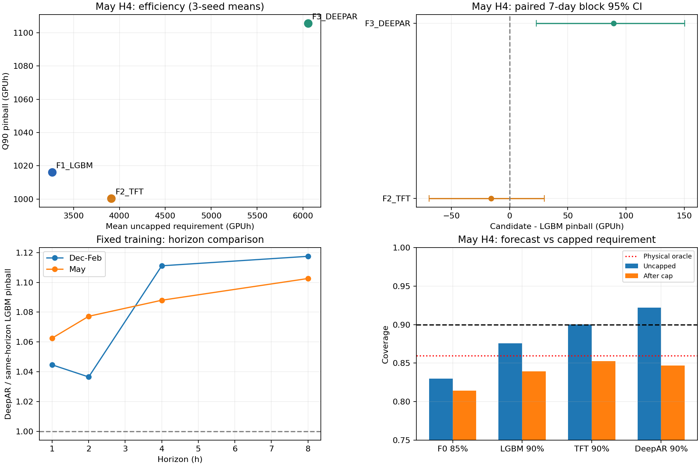

# CC4 forecast-only replacement comparison

**Result: NO_REPLACEMENT_SUPPORTED / NO_UNTOUCHED_CONFIRMATION.**

Read [the Korean final review](FINAL_REVIEW_KO.md), [metrics](MODEL_METRICS.csv),
[horizon comparison](HORIZON_COMPARISON.csv), and [refit comparison](REFIT_COMPARISON.csv).
This directory archives the completed September 24 experiment; it does not install or promote a predictor.



## Evidence and scope

- Frozen H4 LightGBM reproduction, TFT/DeepAR candidates with three seeds, seasonal/constant comparators, causal expanding refits and H1/H2/H4/H8 comparisons.
- `PREDICTIONS.parquet`: 665,874 rows, including unrepaired model quantiles, operational quantile repair, calibrated uncapped forecasts and capped requirements. Secured reserve is intentionally absent because no optimizer was run.
- `DELIVERY_MANIFEST.json`: original hashes of all 12 required deliverables. Their bytes are preserved.
- `MODEL_AND_MEMBERSHIP_EVIDENCE.tar.gz`: model files, original training/inference receipts, intermediate predictions, calibration membership and refit membership. `BUNDLE_MEMBER_MANIFEST.json` lists every member and its SHA256.
- `FINAL_SELECTION_FREEZE.json`: executed code and configuration freeze. `EXECUTION_CORRECTION.json` documents the subsequent constant-comparator dtype correction; candidate training and selection were unchanged.
- `VALIDATION.json` and `FINAL_CHECKS.json`: original experiment checks. `PR_VALIDATION.json`: independent verification of this publication package.

May TFT calibrated Q90 pinball is 1.55% lower than nominal-90 LightGBM, but its paired day-block confidence interval includes zero and the advantage does not persist in Dec–Feb. The development-selected DeepAR has 8.80% higher May calibrated pinball and 85.21% higher mean requirement. No candidate is recommended for integration. May and Dec–Feb are exposed historical periods.

## Verify without training or production access

Run `python verify_package.py` from this directory, or pass the script's absolute path.
It uses the Python standard library, checks original deliverable and frozen-code hashes,
and verifies every archive member without extracting files. It does not import the experiment runner.

To inspect checkpoints, extract `MODEL_AND_MEMBERSHIP_EVIDENCE.tar.gz` into this directory in an independent checkout. No extraction is necessary to review the reports or metrics.

## Replay limitations and source authority

The executed Python scripts are archived byte-for-byte, including their original local paths; they are **not a portable, automatic retraining command**. `README_KO.md` records the original execution order. Running the original scripts in a different folder requires explicit path configuration and the original external authorities. Preserve the frozen files and perform any adaptation in a new namespace.

`DATA.npz` and `DAY_LEDGER.parquet` retain prepared training/evaluation arrays. Original raw archive bytes, raw job caches, historical source copies and the plotting runtime are not duplicated here. Full raw reconstruction additionally requires the archive identified by SHA256 in `RAW_INVENTORY.json` and the original May snapshots/authority files identified in `SOURCE_AND_MODEL_LINEAGE.json`. Those machine-specific paths are provenance records, not repository-relative dependencies. Frozen model evidence is included in the bundle; historical Git sources can be recovered at these exact refs:

- [V41R4 / PR #42](https://github.com/BeaverVillage/MobileESS/tree/04f9c738ad80786b3860638304043b06129c04ef)
- [R6 / PR #33](https://github.com/BeaverVillage/MobileESS/tree/2d6e22e2b448454bb4a860a07f38c20ad3ef834d)
- [R6R1 / PR #34](https://github.com/BeaverVillage/MobileESS/tree/4309a4e5ea2c7893f79bcc7e747ca7d13fc5de42)
- [R3 neural study](https://github.com/BeaverVillage/MobileESS/tree/43710c96c36f7e66257885a56ef6df697b3c53bb)

The archived `setup.py` documents the scoped Git paths for retrieval. The original NONE/FAIL/NO_MODEL_PROMOTED decisions remain intact.

```text
NEW_MODEL_AUTO_DEPLOYED = FALSE
OPTIMIZER_CHANGED = FALSE
GRID_CAMPAIGN_EXECUTIONS = 0
EXISTING_PRODUCTION_MODIFIED = FALSE
```
