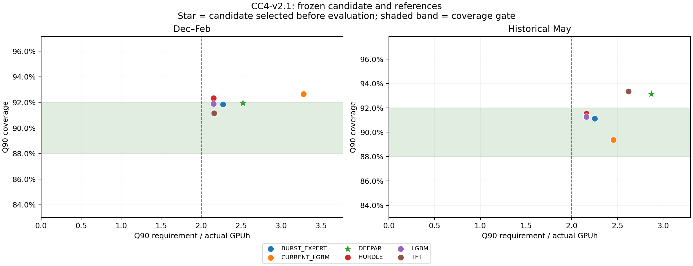

# CC4-v2.1 정량 검토 보충

평가 전 고정한 DeepAR 후보는 기존 LightGBM을 대체할 근거를 확보하지 못했다. 같은 LightGBM에서 시간 정책만 바꾼 비교는 두 평가 구간 모두 유의하게 개선됐지만, DeepAR architecture와 calibration의 추가 개선은 입증되지 않았다.

## 전체 모델 비교

아래는 고정된 expanding calibration을 적용한 candidate와 PR63 frozen baseline이다. Neural 값은 세 고정 seed별 지표의 평균이다. 평가 결과로 후보를 다시 선택하지 않았다.

| 구간 | 모델 | Q90 coverage | positive | burst | requirement ratio | Q90 pinball |
|---|---|---:|---:|---:|---:|---:|
| Dec–Feb | BURST_EXPERT | 91.86% | 89.48% | 16.67% | 2.275 | 206.091 |
| Dec–Feb | CURRENT_LGBM | 92.66% | 90.52% | 31.82% | 3.282 | 225.767 |
| Dec–Feb | DEEPAR | 91.93% | 89.58% | 27.53% | 2.524 | 209.043 |
| Dec–Feb | HURDLE | 92.33% | 90.09% | 18.94% | 2.155 | 203.300 |
| Dec–Feb | LGBM | 91.90% | 89.54% | 18.18% | 2.157 | 203.476 |
| Dec–Feb | TFT | 91.15% | 88.56% | 22.22% | 2.162 | 204.697 |
| May | BURST_EXPERT | 91.13% | 89.67% | 31.88% | 2.252 | 306.431 |
| May | CURRENT_LGBM | 89.38% | 87.64% | 36.23% | 2.455 | 310.683 |
| May | DEEPAR | 93.15% | 92.02% | 44.93% | 2.872 | 317.846 |
| May | HURDLE | 91.53% | 90.14% | 30.43% | 2.161 | 304.309 |
| May | LGBM | 91.26% | 89.83% | 27.54% | 2.161 | 301.926 |
| May | TFT | 93.37% | 92.28% | 40.10% | 2.622 | 306.822 |

## 분리된 효과와 불확실성

Delta는 candidate minus reference이며 음수일 때 pinball 개선이다. 7일 paired block bootstrap 2,000회의 95% CI를 표시한다. 1일 bootstrap은 원본 CSV에 함께 있다.

| 구간 | 효과 | Delta pinball | 95% CI |
|---|---|---:|---|
| Dec–Feb | 동일 LightGBM: causal refit vs fixed | -7.580 | [-11.683, -3.658] |
| May | 동일 LightGBM: causal refit vs fixed | -14.016 | [-24.539, -3.078] |
| Dec–Feb | 동일 정책: DeepAR vs monolithic raw | 3.799 | [-0.755, 8.602] |
| May | 동일 정책: DeepAR vs monolithic raw | 11.094 | [-1.913, 21.945] |
| Dec–Feb | 동일 DeepAR: calibration vs raw | 2.198 | [-0.318, 4.999] |
| May | 동일 DeepAR: calibration vs raw | -1.026 | [-4.790, 3.421] |
| Dec–Feb | 고정 후보 vs PR63 current | -16.724 | [-24.217, -7.790] |
| May | 고정 후보 vs PR63 current | 7.163 | [-1.223, 16.357] |

## Gate 판정의 근거

- Dec–Feb 후보는 overall/positive coverage와 선호 pinball 개선을 충족했으나 burst 27.53% 및 requirement ratio 2.524로 탈락했다.
- May 후보는 overall coverage 93.15%로 상한 92%를 넘고, burst 44.93% 및 ratio 2.872로 탈락했다. Pinball은 baseline 310.683에서 317.846으로 증가했고, paired CI가 0을 포함한다.
- 평가 후 다른 architecture로 선택을 바꾸거나 coverage를 맞추기 위해 scale/cap을 조정하지 않았다.
- target/interface 판정은 offline GPU-work arrival 정의와 event-time 계약에 한정된다. 실제 ingestion latency 인증, production replacement 및 optimizer integration 준비 완료를 뜻하지 않는다.

## 검증과 구현 범위

5개 contract test, 3,325개 exact fit membership, 3,326개 prediction receipt 및 1,638개 neural checkpoint digest 검사를 통과했다. May refit에는 해당 issue에 이미 성숙한 Mar–Apr history가 최소 52일, 최대 61일 포함됐다.

TFT/DeepAR는 PR63의 compact 연구 구현이다. 구현·sampling·seed의 범위는 [NEURAL_MODEL_SCOPE.md](NEURAL_MODEL_SCOPE.md)에 있다. Bootstrap CI는 사전에 고정한 세 seed를 조건으로 한 날짜 변동을 나타내며, 모든 training seed에 대한 불확실성 보장이 아니다.

