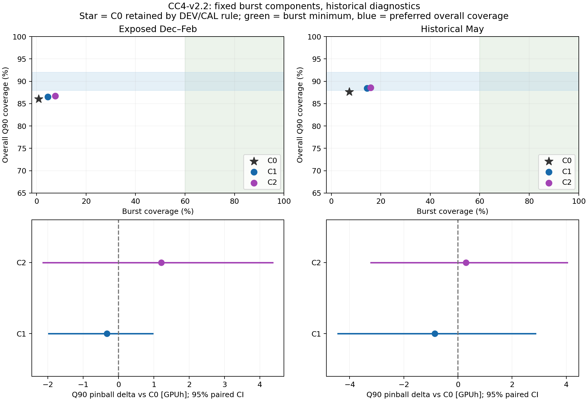

# 고정 risk gate의 historical 진단

아래 ceiling은 gate 안의 모든 burst를 완벽하게 덮더라도, gate 밖 예측을 C0로 유지할 때 달성 가능한 optimistic burst coverage다. 실제 outcome을 이용한 사후 진단이며 선택·threshold·예측을 변경하지 않는다. 다른 gate/feature의 가능성을 제한하는 주장이 아니다.

| 구간 | burst 수 | gate 내 burst | 밖에서 C0가 덮은 burst | gate recall | optimistic ceiling |
|---|---:|---:|---:|---:|---:|
| CALIBRATION | 38 | 5 | 0 | 13.16% | 13.16% |
| DEVELOPMENT | 83 | 7 | 0 | 8.43% | 8.43% |
| EXPOSED_EVALUATION | 132 | 21 | 0 | 15.91% | 15.91% |
| MAY_HISTORICAL | 69 | 25 | 1 | 36.23% | 37.68% |

May C1의 전체 coverage·positive coverage·requirement ratio는 선호 범위를 만족하고 pinball point estimate도 C0보다 낮다. 그러나 burst coverage는 최소 60%에 미달하며 pinball delta CI가 0을 포함한다. C2도 burst minimum에 미달하고 pinball point estimate가 소폭 높다. DEV/CAL에서 고정한 C0 유지 결정을 바꾸지 않는다.

Burst coverage delta의 95% CI가 양수인 사실과 운영 minimum을 충족한다는 주장은 구분한다. 여기서는 작은 burst 개선은 관측되지만, 고정 risk gate가 포착하는 burst 수가 부족하다.

