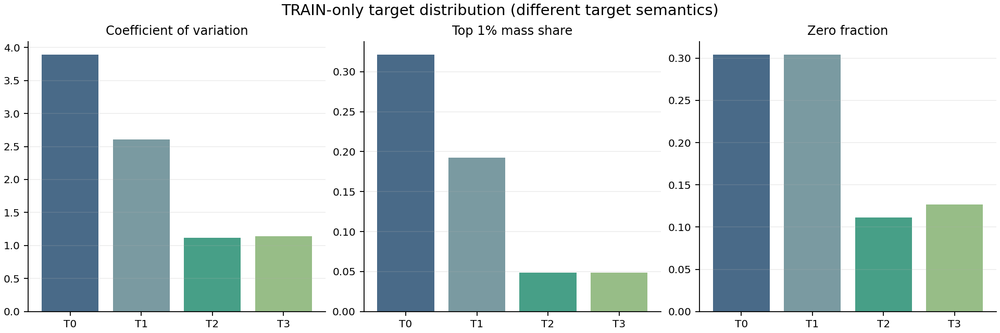
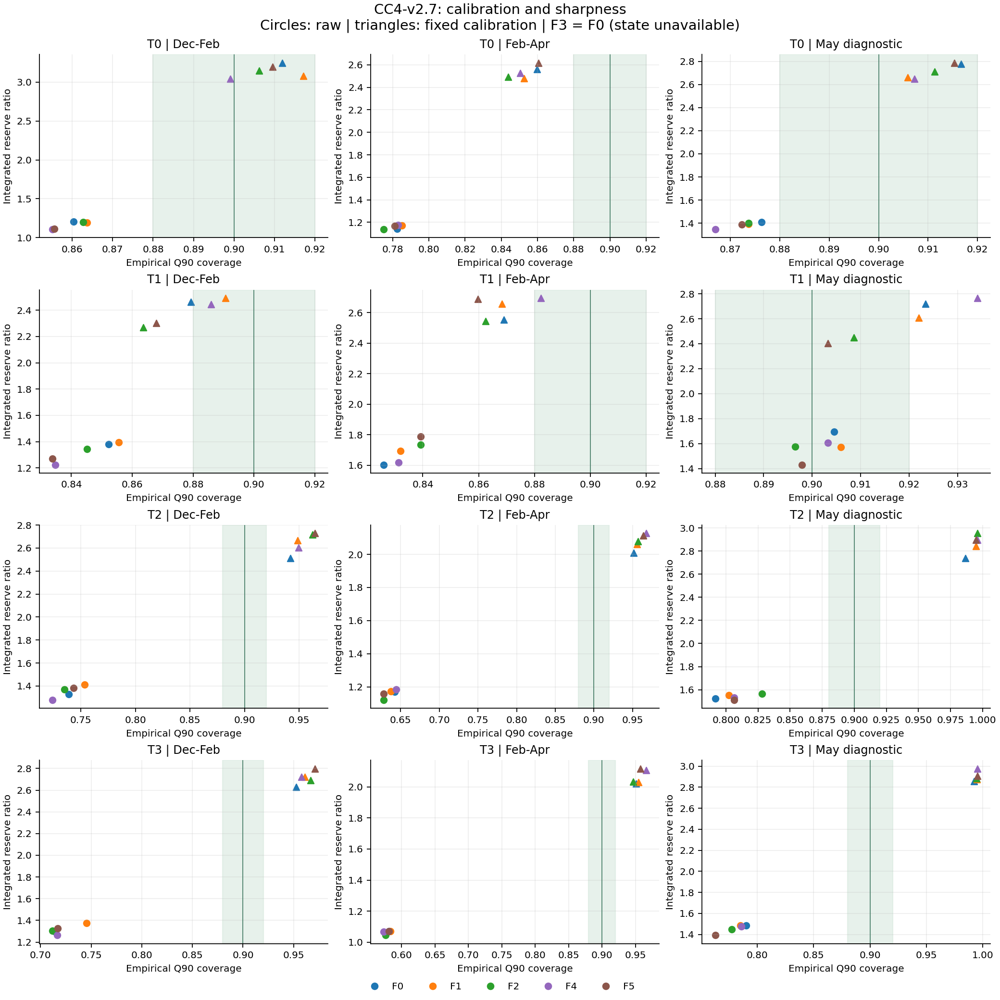
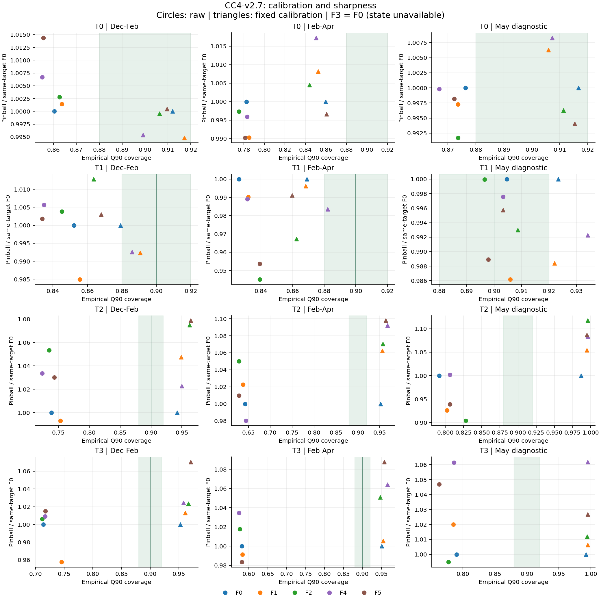

# CC4-v2.7 최종 검토

PR #74의 `bae7916c759e1c845bb87a8ee0dff761b5db7f7a`에서 분기한 독립 오프라인 실험이다. 이전 증거와 V42/optimizer/MESS/IEEE/OpenDSS는 변경하지 않았다. 원 타깃과 기준 예측은 정확히 재현했다. 타깃 정합성, 특징 효과, 해상도 효과, 모델 분할 효과를 별도 평가했다.

T0의 시간 집중과 운영 점유량 불일치는 확인됐지만, 타깃 변경만으로 Q90 보정 문제가 해결되지는 않았다. DEV의 raw 24개 조합 모두 88~92% 밴드를 통과하지 못했고, 다기간 피처 지지 조건을 통과한 조합은 없다. 두 연구 후보의 DEV 선택은 M0 유지다. 교체와 optimizer 통합 준비는 모두 FALSE다.

## 20개 필수 질문에 대한 답변

**1. T0를 정확히 재구성했는가?** 예. 1,056만 원시 행에서 같은 1,030,506개 적격 작업을 복원했고 443일 T0 배열과 성숙 시각이 비트 단위로 같다. A0의 273일 일별 재학습 Q50/Q90도 원 결과와 완전히 같다. `A0_VERIFIED.json`은 초기 모델 검증 후 완료한 타깃 검증을 연결한다.

**2. 발행 후 자정 전 제출의 기여는?** 전체 일 적분량의 6.383% (91,774.676 GPUh / 1,437,824.592 GPUh)다. 양수 미지 부하 피크가 있는 425일의 15분 평균 GPU 피크 시점에서 해당 모집단 기여율 평균은 5.180%다. 0 분모 날짜의 비율은 미정의이며 모든 날짜는 일 적분 합계에 포함된다. 이는 최대값끼리의 비율이 아니라 같은 피크 시점에서 평가한 비율이다.

| role | days | defined_peak_days | all_zero_unknown_days | preD00_submissions | preD00_overlap_GPUh | unknown_GPUh | mass_fraction | mean_peak_fraction |
| --- | --- | --- | --- | --- | --- | --- | --- | --- |
| CALIBRATION | 29 | 29 | 0 | 2737 | 2698.5 | 97873 | 0.027571 | 0.0081147 |
| DEVELOPMENT | 60 | 54 | 6 | 5167 | 15776 | 1.7676e+05 | 0.089255 | 0.1066 |
| EXPOSED_EVALUATION | 88 | 82 | 6 | 38825 | 20187 | 3.1216e+05 | 0.064668 | 0.039643 |
| MAY_HISTORICAL | 31 | 31 | 0 | 5028 | 8923.6 | 1.0674e+05 | 0.083599 | 0.038801 |
| OOS_EXTENSION | 63 | 62 | 1 | 17855 | 30956 | 3.1413e+05 | 0.098545 | 0.087546 |
| PURGE | 3 | 3 | 0 | 260 | 282.67 | 9685 | 0.029186 | 0.020661 |
| TRAIN | 169 | 164 | 5 | 74279 | 12951 | 4.2048e+05 | 0.030801 | 0.037064 |

**3. 수명 GPUh를 제출 시간에 몰아넣으면 버스트성이 커지는가?** 이 자료에서는 그렇다. 런타임 곱을 제거한 T1도 T0보다 변동계수와 상위 1% 질량 비중이 작다. T2/T3에서는 실행시간 분산과 발행 후 6시간 모집단 보완이 함께 달라지므로 그 차이 전부를 한 원인에만 배분할 수는 없다.

| target | zero_fraction | CV | skewness | top1_mass_share | max_positive_median |
| --- | --- | --- | --- | --- | --- |
| T0 | 0.30414 | 3.8912 | 11.04 | 0.32123 | 294.22 |
| T1 | 0.30414 | 2.604 | 5.2888 | 0.19267 | 180.95 |
| T2 | 0.11153 | 1.1194 | 1.4897 | 0.048966 | 6.6091 |
| T3 | 0.12668 | 1.1428 | 1.4974 | 0.048495 | 6.6021 |

T0 버스트 슬롯 질량 중 실행 24시간 초과 작업 기여는 48.75%, 4 GPU 초과 작업 기여는 18.02%다. 두 범주는 겹칠 수 있다. 슬롯 질량의 10/25/50% 초과 작업 수는 TARGET_SLOT_CONTRIBUTIONS.csv에 모두 보존했다. 같은 D일 제출 모집단의 전체 수명량 중 실제로 D일 이후에 실행되는 비중은 전체 54.33%, TRAIN 32.14%다. T2 일 적분량 = 같은 D일 제출 작업의 D일 실행량 + 발행 후 자정 전 제출 작업의 D일 실행량 항등식도 독립 검증했다.

**4. T1이 더 예측하기 쉬운가?** EXPOSED_EVALUATION: TRAIN 평균 정규화 pinball 0.163 대 T0 1.366, WAPE 0.882 대 0.938; OOS_EXTENSION: TRAIN 평균 정규화 pinball 0.156 대 T0 1.740, WAPE 0.881 대 0.927; MAY_HISTORICAL: TRAIN 평균 정규화 pinball 0.192 대 T0 2.070, WAPE 0.926 대 0.949. 이는 서로 다른 예측 대상의 무차원 기술 비교이며 같은 라벨에서의 모델 우위 검정은 아니다. 단위가 달라 절대 MAE·pinball은 비교하지 않는다. 분포 완화만으로 전력 타깃 적합성이나 일반적 예측 우위를 주장하지 않는다.

| target | role | Q90_coverage | Q90_pinball_per_TRAIN_mean | Q50_WAPE | requirement_ratio |
| --- | --- | --- | --- | --- | --- |
| T0 | EXPOSED_EVALUATION | 0.86032 | 1.3657 | 0.93823 | 1.2093 |
| T0 | OOS_EXTENSION | 0.78241 | 1.7403 | 0.92668 | 1.1428 |
| T0 | MAY_HISTORICAL | 0.87634 | 2.0702 | 0.94915 | 1.4079 |
| T1 | EXPOSED_EVALUATION | 0.85227 | 0.16332 | 0.8823 | 1.3807 |
| T1 | OOS_EXTENSION | 0.82606 | 0.15643 | 0.88084 | 1.6038 |
| T1 | MAY_HISTORICAL | 0.90457 | 0.19196 | 0.92592 | 1.697 |
| T2 | EXPOSED_EVALUATION | 0.73864 | 0.31717 | 0.57028 | 1.3287 |
| T2 | OOS_EXTENSION | 0.6422 | 0.36353 | 0.53267 | 1.169 |
| T2 | MAY_HISTORICAL | 0.79167 | 0.26611 | 0.55416 | 1.5223 |
| T3 | EXPOSED_EVALUATION | 0.71378 | 0.33626 | 0.58797 | 1.2984 |
| T3 | OOS_EXTENSION | 0.58118 | 0.41824 | 0.54858 | 1.072 |
| T3 | MAY_HISTORICAL | 0.78999 | 0.25843 | 0.52719 | 1.4837 |

**5. T2가 T0보다 쉽고 안정적인가?** 라벨 분포는 훨씬 안정적이다. EXPOSED_EVALUATION: TRAIN 평균 정규화 pinball 0.317 대 T0 1.366, WAPE 0.570 대 0.938; OOS_EXTENSION: TRAIN 평균 정규화 pinball 0.364 대 T0 1.740, WAPE 0.533 대 0.927; MAY_HISTORICAL: TRAIN 평균 정규화 pinball 0.266 대 T0 2.070, WAPE 0.554 대 0.949. 이는 서로 다른 예측 대상의 무차원 기술 비교이며 같은 라벨에서의 모델 우위 검정은 아니다. 낮은 오차와 명목 coverage 충족 여부는 별개로 평가한다.

**6. T3는 T2보다 정확한가, 더 시끄러운가?** T3의 TRAIN 변동계수·0 비율은 T2보다 높다. 공통 시간별 해상도 대조 결과: T3_F0 hourly aggregate minus T2_F0, EXPOSED_EVALUATION: 방향 불확실 (Δ 1.510, 95% CI [-0.399, 3.811]); T3_F0 hourly aggregate minus T2_F0, OOS_EXTENSION: 손실 증가 지지 (Δ 5.325, 95% CI [1.136, 10.488]); T3_F0 hourly aggregate minus T2_F0, MAY_HISTORICAL: 방향 불확실 (Δ -1.213, 95% CI [-2.550, 0.171]); T3_F5 hourly aggregate minus T2_F5, EXPOSED_EVALUATION: 방향 불확실 (Δ 1.062, 95% CI [-2.200, 4.224]); T3_F5 hourly aggregate minus T2_F5, OOS_EXTENSION: 손실 증가 지지 (Δ 4.265, 95% CI [0.749, 7.932]); T3_F5 hourly aggregate minus T2_F5, MAY_HISTORICAL: 방향 불확실 (Δ 1.762, 95% CI [-0.312, 4.339]). 네 주변 Q90의 평균은 다시 추정한 시간별 Q90이나 공동 일 Q90이 아니다.

| contrast | role | delta | CI_low | CI_high |
| --- | --- | --- | --- | --- |
| T3_F0 hourly aggregate minus T2_F0 | EXPOSED_EVALUATION | 1.5099 | -0.39944 | 3.8106 |
| T3_F0 hourly aggregate minus T2_F0 | OOS_EXTENSION | 5.3248 | 1.1362 | 10.488 |
| T3_F0 hourly aggregate minus T2_F0 | MAY_HISTORICAL | -1.2131 | -2.5501 | 0.17083 |
| T3_F5 hourly aggregate minus T2_F5 | EXPOSED_EVALUATION | 1.0616 | -2.1996 | 4.2237 |
| T3_F5 hourly aggregate minus T2_F5 | OOS_EXTENSION | 4.265 | 0.74896 | 7.9318 |
| T3_F5 hourly aggregate minus T2_F5 | MAY_HISTORICAL | 1.7617 | -0.31229 | 4.3388 |

**7. 어떤 타깃이 전기적 미지 점유에 정합적인가?** T2/T3다. 시간별 상관 1과 피크 오차 0은 정의상 항등식이며 예측 성공이 아니다. T0/T1은 도착량이다. 허가된 PCC 변환이 없어 GPU 점유까지만 결론 낸다.

| target | Pearson | Spearman | peak_time_MAE_hours | top10_slot_overlap | top5_slot_overlap |
| --- | --- | --- | --- | --- | --- |
| T0 | 0.16607 | 0.45333 | 4.5868 | 0.32136 | 0.25749 |
| T1 | 0.1244 | 0.41054 | 5.3832 | 0.28743 | 0.23353 |
| T2 | 1 | 1 | 0 | 1 | 1 |
| T3 | 1 | 1 | 0 | 1 | 1 |

**8. 명시적 1/2/3일 동일 시각 정보가 개선하는가?** 등록된 다기간 지지 기준을 통과한 조합 없음. 성숙한 값만 사용했다. F1은 1/2/3/7/14/21/28일과 최신 가용 후보의 묶음이므로 1/2/3일 단독 효과는 식별하지 못한다.

**9. 세밀한 최근 도착 정보가 버스트 예측을 개선하는가?** 등록된 다기간 지지 기준을 통과한 조합 없음. 아래는 F2−F0의 raw 버스트 coverage 차이다. 양수 CI는 버스트 포착률 상승을, 0 포함은 방향 불확실을 뜻한다. nan은 일부 bootstrap draw에 버스트가 없어 분모가 0이 되었으므로 해당 CI 전체를 미정의로 보존했다는 뜻이다. 전체·양수·버스트 coverage는 STRATIFIED_METRICS.csv에도 분리했다. 버스트 coverage 상승 하나만으로 reserve 팽창을 정당화하지 않는다.

| contrast | role | delta | CI_low | CI_high |
| --- | --- | --- | --- | --- |
| T0_F2 minus T0_F0 | EXPOSED_EVALUATION | 0 | -0.020837 | 0.021587 |
| T0_F2 minus T0_F0 | OOS_EXTENSION | -0.032258 | -0.066667 | 0 |
| T1_F2 minus T1_F0 | EXPOSED_EVALUATION | 0 | nan | nan |
| T1_F2 minus T1_F0 | OOS_EXTENSION | 0 | nan | nan |
| T2_F2 minus T2_F0 | EXPOSED_EVALUATION | 0 | 0 | 0 |
| T2_F2 minus T2_F0 | OOS_EXTENSION | 0 | nan | nan |
| T3_F2 minus T3_F0 | EXPOSED_EVALUATION | 0 | 0 | 0 |
| T3_F2 minus T3_F0 | OOS_EXTENSION | 0 | 0 | 0 |

**10. RUNNING/PENDING 특징이 정보를 추가하는가?** 판정 불가. 정확한 과거 발행 시점 스냅샷이 없어 NOT_AVAILABLE로 제외했다. F3=F0는 결측 대조군이며 상태 특징이 무용하다는 결과가 아니다.

**11. 공휴일·레짐 특징이 중요한가?** 요일·월·계절 F4에 대해서는 등록된 다기간 지지 기준을 통과한 조합 없음. 공휴일 관할과 원본 달력이 없어 공휴일 및 전후일 효과는 미검증이다.

**12. 가장 큰 강건한 개선 그룹은?** 등록된 다기간 조건을 통과한 조합: 없음. 서로 다른 타깃의 원 단위 손실을 섞어 단일 우승 그룹을 만들지 않았다. FEATURE_ABLATION.csv와 아래 CI에 상대 개선을 보존했다.

**13. F5가 여러 OOS 기간에서 F0를 이기는가?** 아래 상대 손실·요구량·MAE를 확인한다. 지지 조건을 통과한 F5는 등록된 다기간 지지 기준을 통과한 조합 없음. 5월은 진단이며 선택에 쓰지 않았다.

| arm | role | pinball_relative | delta_coverage | requirement_ratio_relative | delta_MAE |
| --- | --- | --- | --- | --- | --- |
| T0_F5 | EXPOSED_EVALUATION | 1.0144 | -0.0047348 | 0.9194 | 0.84326 |
| T0_F5 | MAY_HISTORICAL | 0.99819 | -0.0040323 | 0.98524 | -2.4893 |
| T0_F5 | OOS_EXTENSION | 0.9902 | -0.0013228 | 1.023 | 0.62815 |
| T1_F5 | EXPOSED_EVALUATION | 1.0018 | -0.018466 | 0.9202 | -0.32519 |
| T1_F5 | MAY_HISTORICAL | 0.9889 | -0.0067204 | 0.84375 | -1.3855 |
| T1_F5 | OOS_EXTENSION | 0.95364 | 0.013228 | 1.1142 | -4.4779 |
| T2_F5 | EXPOSED_EVALUATION | 1.0303 | 0.0047348 | 1.0415 | 2.5622 |
| T2_F5 | MAY_HISTORICAL | 0.93884 | 0.014785 | 0.99315 | -10.16 |
| T2_F5 | OOS_EXTENSION | 1.0098 | -0.013889 | 0.99152 | -5.526 |
| T3_F5 | EXPOSED_EVALUATION | 1.015 | 0.0034328 | 1.0224 | 0.29188 |
| T3_F5 | MAY_HISTORICAL | 1.0468 | -0.027218 | 0.93904 | -5.6718 |
| T3_F5 | OOS_EXTENSION | 0.9835 | 0.00033069 | 0.99889 | -6.5781 |

**14. 리드타임별 성능이 다른가?** 아래 coverage 범위와 HOUR_SLOT_METRICS/LEAD_GROUP_METRICS의 손실·비율을 함께 본다. 네 그룹은 [6,12), [12,18), [18,24), [24,30)시간이다.

| arm | variant | role | min | max | spread |
| --- | --- | --- | --- | --- | --- |
| T2_F0 | CALIBRATED | EXPOSED_EVALUATION | 0.91288 | 0.97538 | 0.0625 |
| T2_F0 | CALIBRATED | OOS_EXTENSION | 0.93915 | 0.97884 | 0.039683 |
| T2_F0 | RAW | EXPOSED_EVALUATION | 0.69129 | 0.8428 | 0.15152 |
| T2_F0 | RAW | OOS_EXTENSION | 0.55026 | 0.84656 | 0.2963 |
| T3_F2 | CALIBRATED | EXPOSED_EVALUATION | 0.94744 | 0.98438 | 0.036932 |
| T3_F2 | CALIBRATED | OOS_EXTENSION | 0.92262 | 0.97156 | 0.048942 |
| T3_F2 | RAW | EXPOSED_EVALUATION | 0.66146 | 0.81487 | 0.15341 |
| T3_F2 | RAW | OOS_EXTENSION | 0.4828 | 0.76653 | 0.28373 |

**15. pooled LightGBM이 여전히 적절한가?** 타깃·특징 고정 후 동일 설정의 네 리드 그룹 M1과 비교했다. DEV 동결 선택은 {'T2_F0': 'M0', 'T3_F2': 'M0'}다. 아래 Stage2 CI가 0을 포함하거나 악화되면 복잡도를 늘릴 근거가 부족하다. DEV에서 선택된 모델도 확인되지 않은 운영 승격을 뜻하지 않는다.

**16. 리드 그룹 모델이 도움이 되는가?** T2_F0 M1 minus M0, EXPOSED_EVALUATION: 방향 불확실 (Δ 0.105, 95% CI [-2.415, 2.769]); T2_F0 M1 minus M0, OOS_EXTENSION: 손실 증가 지지 (Δ 3.830, 95% CI [0.743, 6.665]); T2_F0 M1 minus M0, MAY_HISTORICAL: 방향 불확실 (Δ -2.636, 95% CI [-6.653, 0.593]); T3_F2 M1 minus M0, EXPOSED_EVALUATION: 방향 불확실 (Δ 0.092, 95% CI [-2.757, 2.635]); T3_F2 M1 minus M0, OOS_EXTENSION: 방향 불확실 (Δ 2.396, 95% CI [-2.518, 7.678]); T3_F2 M1 minus M0, MAY_HISTORICAL: 방향 불확실 (Δ 0.680, 95% CI [-0.891, 2.235]). M1−M0 raw pinball의 일 단위 7일 블록 CI를 사용했다.

| contrast | role | delta | CI_low | CI_high |
| --- | --- | --- | --- | --- |
| T2_F0 M1 minus M0 | EXPOSED_EVALUATION | 0.1047 | -2.415 | 2.7685 |
| T2_F0 M1 minus M0 | OOS_EXTENSION | 3.8298 | 0.74341 | 6.6647 |
| T2_F0 M1 minus M0 | MAY_HISTORICAL | -2.6359 | -6.6527 | 0.59254 |
| T3_F2 M1 minus M0 | EXPOSED_EVALUATION | 0.091993 | -2.7573 | 2.6352 |
| T3_F2 M1 minus M0 | OOS_EXTENSION | 2.3957 | -2.5181 | 7.6776 |
| T3_F2 M1 minus M0 | MAY_HISTORICAL | 0.67996 | -0.89054 | 2.2345 |

**17. 큰 reserve 팽창 없이 90%에 접근하는가?** RAW와 고정 보정 결과를 아래 필수 비교표에서 함께 보고한다. 88~92% 밴드를 넘긴 coverage는 자동 개선이 아니다. 두 연구 후보가 기존 평가와 확장 평가에서 모두 밴드 안에 있는지: False.

**18. 타깃별 최선의 요구량 비율은?** 아래는 각 보고 기간에서 밴드 안인 조합 중 최소 비율의 사후 기술통계다. 선택 동결을 바꾸지 않는다. NONE_IN_BAND면 조건을 만족한 조합이 없다. T1 적분량 단위는 requested GPU이며 GPUh가 아니다.

| target | role | variant | arm | ratio | coverage |
| --- | --- | --- | --- | --- | --- |
| T0 | EXPOSED_EVALUATION | CALIBRATED | T0_F4 | 3.043 | 0.89915 |
| T0 | EXPOSED_EVALUATION | RAW | NONE_IN_BAND | nan | nan |
| T0 | OOS_EXTENSION | CALIBRATED | NONE_IN_BAND | nan | nan |
| T0 | OOS_EXTENSION | RAW | NONE_IN_BAND | nan | nan |
| T1 | EXPOSED_EVALUATION | CALIBRATED | T1_F4 | 2.4463 | 0.88589 |
| T1 | EXPOSED_EVALUATION | RAW | NONE_IN_BAND | nan | nan |
| T1 | OOS_EXTENSION | CALIBRATED | T1_F4 | 2.6952 | 0.88228 |
| T1 | OOS_EXTENSION | RAW | NONE_IN_BAND | nan | nan |
| T2 | EXPOSED_EVALUATION | CALIBRATED | NONE_IN_BAND | nan | nan |
| T2 | EXPOSED_EVALUATION | RAW | NONE_IN_BAND | nan | nan |
| T2 | OOS_EXTENSION | CALIBRATED | NONE_IN_BAND | nan | nan |
| T2 | OOS_EXTENSION | RAW | NONE_IN_BAND | nan | nan |
| T3 | EXPOSED_EVALUATION | CALIBRATED | NONE_IN_BAND | nan | nan |
| T3 | EXPOSED_EVALUATION | RAW | NONE_IN_BAND | nan | nan |
| T3 | OOS_EXTENSION | CALIBRATED | NONE_IN_BAND | nan | nan |
| T3 | OOS_EXTENSION | RAW | NONE_IN_BAND | nan | nan |

**19. 개선이 통계적으로 지지되는가?** PAIRED_UNCERTAINTY.csv에 같은 날짜를 쌍으로 resample한 1일/7일 circular block, 2,000회 95% CI를 보존했다. 전 슬롯과 0 라벨을 유지하고 각 draw의 비율을 다시 계산했다. CI가 0을 포함하면 우위를 주장하지 않는다. 다중 비교 미보정 탐색적 CI이며 모델 재학습·선택 불확실성이나 독립 확인시험을 포함하지 않는다.

**20. V42 통합 전에 운영 타깃을 바꿔야 하는가?** 도착 수명량과 실행 점유량은 별도 인터페이스로 구분해야 한다는 근거는 있다. 그러나 이 연구만으로 운영 교체를 승인하지 않는다. 요청 버전·수집 지연·상태 스냅샷·정책에 따른 실행 변경·PCC 변환 계약을 별도 검증하고 독립 V42 통합 작업에서 결정해야 한다. 본 작업의 교체·통합 준비 플래그는 FALSE다.

## 필수 A/B/C/D 및 시간 해상도 대조

| arm | role | variant | Q90_coverage | Q90_pinball | requirement_ratio | Q50_MAE | Q50_WAPE |
| --- | --- | --- | --- | --- | --- | --- | --- |
| T0_F0 | EXPOSED_EVALUATION | RAW | 0.86032 | 203.04 | 1.2093 | 298.66 | 0.93823 |
| T0_F0 | OOS_EXTENSION | RAW | 0.78241 | 258.73 | 1.1428 | 423.48 | 0.92668 |
| T0_F0 | MAY_HISTORICAL | RAW | 0.87634 | 307.78 | 1.4079 | 448.54 | 0.94915 |
| T0_F0 | EXPOSED_EVALUATION | CALIBRATED | 0.91193 | 226.35 | 3.2482 | 298.66 | 0.93823 |
| T0_F0 | OOS_EXTENSION | CALIBRATED | 0.85979 | 235.76 | 2.5613 | 423.48 | 0.92668 |
| T0_F0 | MAY_HISTORICAL | CALIBRATED | 0.91667 | 317.51 | 2.7792 | 448.54 | 0.94915 |
| T0_F5 | EXPOSED_EVALUATION | RAW | 0.85559 | 205.97 | 1.1119 | 299.5 | 0.94087 |
| T0_F5 | OOS_EXTENSION | RAW | 0.78108 | 256.2 | 1.1691 | 424.11 | 0.92806 |
| T0_F5 | MAY_HISTORICAL | RAW | 0.87231 | 307.22 | 1.3871 | 446.05 | 0.94388 |
| T0_F5 | EXPOSED_EVALUATION | CALIBRATED | 0.90956 | 226.46 | 3.1946 | 299.5 | 0.94087 |
| T0_F5 | OOS_EXTENSION | CALIBRATED | 0.86045 | 234.97 | 2.6181 | 424.11 | 0.92806 |
| T0_F5 | MAY_HISTORICAL | CALIBRATED | 0.91532 | 315.63 | 2.7877 | 446.05 | 0.94388 |
| T2_F0 | EXPOSED_EVALUATION | RAW | 0.73864 | 32.971 | 1.3287 | 84.291 | 0.57028 |
| T2_F0 | OOS_EXTENSION | RAW | 0.6422 | 37.791 | 1.169 | 110.66 | 0.53267 |
| T2_F0 | MAY_HISTORICAL | RAW | 0.79167 | 27.663 | 1.5223 | 79.506 | 0.55416 |
| T2_F0 | EXPOSED_EVALUATION | CALIBRATED | 0.94223 | 26.245 | 2.5107 | 84.291 | 0.57028 |
| T2_F0 | OOS_EXTENSION | CALIBRATED | 0.95172 | 22.825 | 2.0092 | 110.66 | 0.53267 |
| T2_F0 | MAY_HISTORICAL | CALIBRATED | 0.98656 | 25.172 | 2.739 | 79.506 | 0.55416 |
| T2_F5 | EXPOSED_EVALUATION | RAW | 0.74337 | 33.969 | 1.3839 | 86.853 | 0.58762 |
| T2_F5 | OOS_EXTENSION | RAW | 0.62831 | 38.162 | 1.1591 | 105.14 | 0.50607 |
| T2_F5 | MAY_HISTORICAL | RAW | 0.80645 | 25.971 | 1.5119 | 69.345 | 0.48334 |
| T2_F5 | EXPOSED_EVALUATION | CALIBRATED | 0.96449 | 28.312 | 2.7284 | 86.853 | 0.58762 |
| T2_F5 | OOS_EXTENSION | CALIBRATED | 0.96362 | 25.06 | 2.1148 | 105.14 | 0.50607 |
| T2_F5 | MAY_HISTORICAL | CALIBRATED | 0.99462 | 27.366 | 2.8959 | 69.345 | 0.48334 |
| T3_F0 | EXPOSED_EVALUATION | RAW | 0.71378 | 34.956 | 1.2984 | 86.906 | 0.58797 |
| T3_F0 | OOS_EXTENSION | RAW | 0.58118 | 43.478 | 1.072 | 113.97 | 0.54858 |
| T3_F0 | MAY_HISTORICAL | RAW | 0.78999 | 26.865 | 1.4837 | 75.637 | 0.52719 |
| T3_F0 | EXPOSED_EVALUATION | CALIBRATED | 0.95265 | 27.414 | 2.6309 | 86.906 | 0.58797 |
| T3_F0 | OOS_EXTENSION | CALIBRATED | 0.95089 | 23.269 | 2.0198 | 113.97 | 0.54858 |
| T3_F0 | MAY_HISTORICAL | CALIBRATED | 0.99227 | 26.84 | 2.8561 | 75.637 | 0.52719 |
| T3_F5 | EXPOSED_EVALUATION | RAW | 0.71721 | 35.48 | 1.3275 | 87.197 | 0.58995 |
| T3_F5 | OOS_EXTENSION | RAW | 0.58151 | 42.761 | 1.0708 | 107.39 | 0.51692 |
| T3_F5 | MAY_HISTORICAL | RAW | 0.76277 | 28.122 | 1.3932 | 69.965 | 0.48766 |
| T3_F5 | EXPOSED_EVALUATION | CALIBRATED | 0.97088 | 29.347 | 2.7988 | 87.197 | 0.58995 |
| T3_F5 | OOS_EXTENSION | CALIBRATED | 0.95784 | 25.311 | 2.1173 | 107.39 | 0.51692 |
| T3_F5 | MAY_HISTORICAL | CALIBRATED | 0.9953 | 27.559 | 2.9086 | 69.965 | 0.48766 |

## Stage2 결과

| arm | model | role | variant | Q90_coverage | Q90_pinball | requirement_ratio | Q50_MAE |
| --- | --- | --- | --- | --- | --- | --- | --- |
| T2_F0 | M0 | EXPOSED_EVALUATION | RAW | 0.73864 | 32.971 | 1.3287 | 84.291 |
| T2_F0 | M0 | OOS_EXTENSION | RAW | 0.6422 | 37.791 | 1.169 | 110.66 |
| T2_F0 | M0 | MAY_HISTORICAL | RAW | 0.79167 | 27.663 | 1.5223 | 79.506 |
| T2_F0 | M0 | EXPOSED_EVALUATION | CALIBRATED | 0.94223 | 26.245 | 2.5107 | 84.291 |
| T2_F0 | M0 | OOS_EXTENSION | CALIBRATED | 0.95172 | 22.825 | 2.0092 | 110.66 |
| T2_F0 | M0 | MAY_HISTORICAL | CALIBRATED | 0.98656 | 25.172 | 2.739 | 79.506 |
| T2_F0 | M1 | EXPOSED_EVALUATION | RAW | 0.71212 | 33.075 | 1.2846 | 80.934 |
| T2_F0 | M1 | OOS_EXTENSION | RAW | 0.61772 | 41.621 | 1.1073 | 103.78 |
| T2_F0 | M1 | MAY_HISTORICAL | RAW | 0.80242 | 25.027 | 1.5299 | 79.111 |
| T2_F0 | M1 | EXPOSED_EVALUATION | CALIBRATED | 0.96117 | 27.506 | 2.7184 | 80.934 |
| T2_F0 | M1 | OOS_EXTENSION | CALIBRATED | 0.96032 | 25.425 | 2.1273 | 103.78 |
| T2_F0 | M1 | MAY_HISTORICAL | CALIBRATED | 0.99731 | 28.837 | 3.0069 | 79.111 |
| T3_F2 | M0 | EXPOSED_EVALUATION | RAW | 0.71188 | 35.171 | 1.3023 | 87.793 |
| T3_F2 | M0 | OOS_EXTENSION | RAW | 0.57606 | 44.254 | 1.0454 | 103.2 |
| T3_F2 | M0 | MAY_HISTORICAL | RAW | 0.77722 | 26.726 | 1.4513 | 71.052 |
| T3_F2 | M0 | EXPOSED_EVALUATION | CALIBRATED | 0.9665 | 28.055 | 2.6916 | 87.793 |
| T3_F2 | M0 | OOS_EXTENSION | CALIBRATED | 0.94692 | 24.454 | 2.0336 | 103.2 |
| T3_F2 | M0 | MAY_HISTORICAL | CALIBRATED | 0.99429 | 27.157 | 2.8822 | 71.052 |
| T3_F2 | M1 | EXPOSED_EVALUATION | RAW | 0.69093 | 35.263 | 1.2329 | 89.733 |
| T3_F2 | M1 | OOS_EXTENSION | RAW | 0.55704 | 46.65 | 0.99542 | 104.82 |
| T3_F2 | M1 | MAY_HISTORICAL | RAW | 0.78629 | 27.406 | 1.4301 | 71.155 |
| T3_F2 | M1 | EXPOSED_EVALUATION | CALIBRATED | 0.95407 | 25.815 | 2.5441 | 89.733 |
| T3_F2 | M1 | OOS_EXTENSION | CALIBRATED | 0.93568 | 23.094 | 1.9282 | 104.82 |
| T3_F2 | M1 | MAY_HISTORICAL | CALIBRATED | 0.99462 | 25.695 | 2.7808 | 71.155 |

M2 기간별 독립 모델, M3 적응형 보정, M4 신경 모델은 이번 고정 프로토콜에서 보류했다. M0/M1의 비교가 Stage2 범위이며 미실행 모델을 검증한 것으로 표시하지 않는다.

## 네 설명의 분리

| explanation | finding | evidence |
| --- | --- | --- |
| A. 모델 구조 | M0/M1의 고정 비교만 수행. 구조 일반의 한계나 신경 모델의 우열은 식별하지 않음 | STAGE2_MODEL_METRICS.csv; M1-minus-M0 paired CI |
| B. 특징 시간 매핑 | 다기간 지지 조합: 없음. 사용 불가 상태·공휴일과 보수적 지연 성숙의 한계는 남음 | FEATURE_ABLATION.csv; SUPPORT_GATES.json |
| C. 운영 타깃 불일치 | 입증됨. T0는 도착 수명량, T2/T3는 발행 후 미지 실행 점유량. 서로 다른 운영 질문에 답함 | TARGET_OPERATIONAL_ALIGNMENT.csv; LIFETIME_PLACEMENT_AUDIT.json; TARGET_BOUNDARY_AUDIT.csv |
| D. 본질적 예측 불확실성 | 식별 불가. 관측 특징·모델·표본 조건에서 남은 오차가 이론적으로 불가약임을 증명하지 않음 | 기간별 오차·CI·SOURCE/FEATURE provenance limits |

## 해석 범위와 재현

전기적 매핑 불일치와 시간 집중은 입증됐다. 아키텍처, 특징 매핑, 운영 타깃, 분포 이동 중 과거 어려움의 몫을 하나의 원인으로 완전히 분해한 것은 아니다. 실패한 조합·hard day·0 라벨·5월 진단을 모두 남겼다. 버스트 임계값은 TRAIN 양수 Q95로 고정했다. 보정은 CAL 성숙 잔차로 고정했고 평가 기간에 업데이트하지 않았다. 원 baseline의 raw 재현과 새 보정 절차의 효과를 구분한다.

SOURCE_MANIFEST는 이전 증거 해시를 검증한다. 새 실험 코드는 EXPERIMENT_CODE_FREEZE에, 선택은 TARGET/FEATURE/STAGE2_SELECTION_FREEZE에, 모든 새 재학습 날짜·가중치·모델 digest는 runs에 저장했다. 학습 모델의 전체 텍스트 대신 결정론적 재학습 recipe와 digest를 보존한다. FEATURE_IMPORTANCE는 마지막 적격 CAL 날짜의 Q50/Q90 합산 gain/split이며 선택에 사용하지 않았다. 후속 재현은 README의 새 디렉터리 절차를 따른다.

## 최종 플래그

| flag | value |
| --- | --- |
| CURRENT_TARGET_REPRODUCED | True |
| POST_ISSUE_PRE_D00_BOUNDARY_AUDITED | True |
| T0_VALID | True |
| T1_VALID | True |
| T2_VALID | True |
| T3_VALID | True |
| TARGET_MAPPING_IS_MAJOR_BOTTLENECK | INCONCLUSIVE |
| FEATURE_MAPPING_IS_MAJOR_BOTTLENECK | INCONCLUSIVE |
| SAME_CLOCK_FEATURE_SUPPORTED | False |
| FINE_RECENCY_FEATURE_SUPPORTED | False |
| ISSUE_STATE_FEATURE_SUPPORTED | False |
| CALENDAR_REGIME_FEATURE_SUPPORTED | False |
| HOURLY_ACTIVE_OCCUPANCY_SUPPORTED | False |
| FIFTEEN_MIN_ACTIVE_OCCUPANCY_SUPPORTED | False |
| TARGET_FEATURE_REDIRECTION_SUPPORTED | False |
| Q90_CALIBRATION_NEAR_NOMINAL | False |
| SHARPNESS_IMPROVEMENT_SUPPORTED | False |
| STAGE2_MODEL_SEARCH_AUTHORIZED | True |
| CC4_V27_REPLACEMENT_SUPPORTED | False |
| CC4_V27_OPTIMIZER_INTEGRATION_READY | False |
