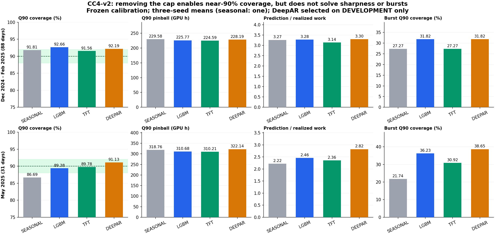

# CC4-v2: D−1 18:00 next-day hourly future workload

Independent forecast-only experiment based on [PR #59](https://github.com/BeaverVillage/MobileESS/pull/59),
with frozen population/feature lineage to [PR #42](https://github.com/BeaverVillage/MobileESS/pull/42)
and the unchanged cap audit in [PR #57](https://github.com/BeaverVillage/MobileESS/pull/57).

Start with [the Korean final review](FINAL_REVIEW_KO.md),
[target definition](TARGET_DEFINITION.md), [registered protocol](EXPERIMENT_PROTOCOL.json),
and [strict decision](FINAL_SELECTION_FREEZE.json). A negative forecast verdict
does not invalidate the arrival/service distinction and does not authorize
production integration.

Completed verdict: target/accounting and leakage checks **PASS**; robust Q90
calibration, model replacement and optimizer readiness **FALSE**. The
DEVELOPMENT-selected DeepAR covers 92.19% in December–February and 91.13% in
May, but requirement ratios are 3.30/2.82 and burst coverage 31.82%/38.65%.
TFT's small pinball advantage over LightGBM includes zero in both paired CIs.
This does demonstrate near-90% uncapped marginal forecast coverage; it does not
demonstrate acceptable overall forecast quality or operational reserve adequacy.



The new namespace alone is modified. Production optimization, P2, AIDC/MESS,
Planning, Fresh/Actual, OpenDSS and Gurobi are neither imported nor executed.
`OPTIMIZER_CHANGED=FALSE`, `GRID_CAMPAIGN_EXECUTIONS=0`,
`PRODUCTION_MODEL_PROMOTED=FALSE`, `NO_UNTOUCHED_CONFIRMATION=TRUE`.

## Evidence map

- `SOURCE_MANIFEST.json`: exact source commits, local raw/frozen paths and hashes.
- `POPULATION_COMPARISON.json`, `DAILY_TARGET_RECONSTRUCTION.csv`,
  `TARGET_RECONSTRUCTION_AUDIT.json`: raw Job identity and GPU·h accounting.
- `DAY_LEDGER.csv`, five `*_MEMBERSHIP.csv`, `SPLIT_MEMBERSHIP_DIFF.csv`,
  `DATA_SPLITS_AND_MATURITY.json`: exact date membership and stage maturity.
- `FEATURE_CONTRACT.json`, `FEATURE_MATURITY_PROOF.parquet`, `LEAKAGE_AUDIT.json`:
  71-feature lineage and counterfactual as-of reconstruction tests.
- `HOURLY_DATASET.parquet`, `DATA.npz`: long-form labels, causal features, history.
- `TARGET_DISTRIBUTION.csv`, `TARGET_HOUR_DISTRIBUTION.csv`,
  `TARGET_WEEKDAY_DISTRIBUTION.csv`: zeros, positives, bursts, maxima and totals.
- `PRETRAIN_CODE_FREEZE.json`, `MODEL_SELECTION_FREEZE.json`,
  `CALIBRATION_FREEZE.json`: immutable chronology and selection evidence.
- `fits/`: actual model files, per-seed training curves/receipts and predictions.
- `PREDICTIONS.parquet`: 24 rows per target day per model/seed, raw and calibrated.
- `MODEL_METRICS.csv`, `DAY_METRICS.csv`, `HOUR_OF_DAY_METRICS.csv`,
  `LEAD_TIME_METRICS.csv`, `BURST_METRICS.csv`, `SEED_MEAN_METRICS.csv`:
  all models/seeds and both raw/calibrated variants. Zero-workload ratios with
  zero denominator are empty/undefined, never fabricated as zero.
- `PAIRED_DAY_BLOCK_UNCERTAINTY.csv`: candidate minus LightGBM paired 7-day
  block differences; 2,000 draws and 95% intervals. Seeds average within day.
- `NO_CAP_AUDIT.json`, `VALIDATION.json`, `DELIVERY_MANIFEST.json`: output and
  package verification. `FAILURES.json` preserves training failures if any.
- `MODEL_PROVENANCE_VALIDATION.json`: checkpoint hashes, exact TRAIN-only
  neural scalers and four byte-identical bindings to original Git authorities.
- `EXECUTION_NOTES.md`, `failed_attempts/`, preparation failure logs: transparent
  pre-evaluation implementation corrections, with original evidence retained.

TFT and DeepAR are the compact PR #59 implementations, not claims of exhaustive
architecture search or full official benchmark reproductions. Two learning
rates per family at seed 20260924, then three seeds at the selected rate.
Only one GPU job runs at a time. LightGBM uses the original 400-tree settings.
The fixed model never refits on DEVELOPMENT, CALIBRATION, December–February,
March–April or May labels. Causal history can use observed/mature past events
from those dates, as known at each issue; that is distinct from parameter fitting.

## Reproduction

The original local runtime is recorded in `ENVIRONMENT.json`; the observed
environment is Python 3.11, PyTorch 2.8.0+cu128, LightGBM 4.6.0, NumPy 1.26.4,
pandas 2.2.3, PyArrow. There is no automatic dependency installation.
Run commands from this directory with that environment. GPU training is
serial. Raw source archives are deliberately external; `SOURCE_MANIFEST.json`
identifies them and their hashes. A fresh reproduction must use a **new empty
experiment directory containing the code**, not overwrite these frozen outputs.

```powershell
python register.py
python prepare.py --authority PATH_TO_ORIGINAL_PR59_EXPERIMENT --raw PATH_TO_RAW_JOB_ZIP --oracle PATH_TO_PR57_AUDIT
python bind_oracle.py
python test_contract.py
python run.py train
python run.py calibrate
python run.py dec-feb
python run.py may
python report.py
python verify.py --external
```

For a read-only published-package check, run `python test_contract.py` and
`python verify.py` (the latter writes only the new validation receipt). It does
not require raw files, PyTorch, GPU, training, production or grid solvers.
Use `--external` to additionally rehash all local original authorities.
`PRETRAIN_CODE_FREEZE.json` is checked before evaluation. Completion receipts
prevent silently rerunning/overwriting exposed results. Any scientific fix
after exposure requires a separately versioned experiment with the old result
preserved.
