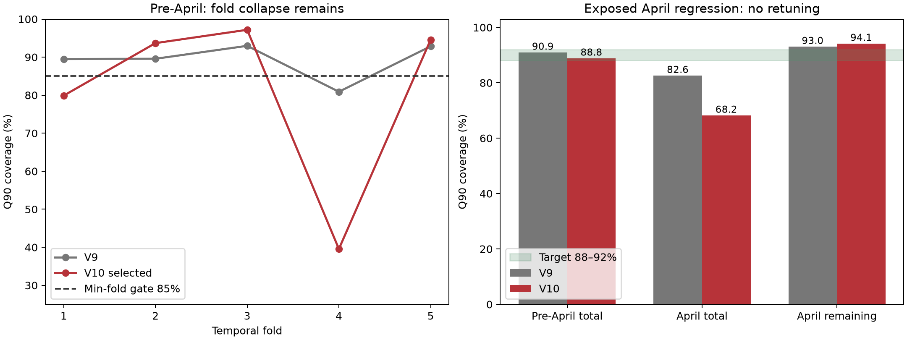

# Runtime-vNext10 최종 검토

**결론: 비승격.** 선택 후보는 **T3_LOGISTIC_STATIC / G1 / LAST_RATE / CPU4**이며 안전성 적격 후보는 0개다. 단조·양의 support·유한 proper score는 확보했지만, 시간별 안정성과 긴 작업 보호를 해결하지 못했다. V42 연구 provider 및 strict production provider 준비 플래그는 모두 FALSE다.

기준 커밋: 06f0c6684aa577744ffc494bc87268b638675e43. 기존 v6/v7/v8/v9 과학 파일 591개와 manifest 4개의 바이트를 유지했다. 변경 범위는 이 디렉터리뿐이며 V42 AIDC, 전기 kernel, CC4, MESS, 기준 배치 및 solver는 수정하지 않았다.

April은 이미 노출된 회귀 자료다. 여섯 동결은 2026-09-29 01:42 UTC에 완료했으며, 이후 April을 한 번 평가했다. April 결과로 어떤 모델·보정·문턱도 바꾸지 않았다. May는 조회·평가·선택에 사용하지 않았다.

## 1. V9에서 정확히 무엇이 실패했는가?

V9의 pre-April pooled Q90은 90.93%였지만 최저 fold 80.90%, >4h 82.82%로 V10 요구 기준에 미달했다. April total 82.56%, remaining 93.02%도 목표 범위 밖이었다. 양의 additive shift가 초기 시간의 확률 support를 없애 proper log score를 무한대로 만들었다. V9를 통과 모델로 재해석하지 않았다. 이번 5개 fold 재현의 예측 최대 오차는 모두 0초다.

## 2. V10에서 왜 hazard framework를 유지했는가?

하나의 job별 total 분포에서 시작 전 Q50/Q90과 실행 중 S(e+r)/S(e)를 모두 구할 수 있어서다. target은 end-start 실행시간이고 queue wait나 요청 walltime이 아니다. 별도 remaining learner와 폭넓은 모델 탐색은 추가하지 않았다.

## 3. V9 tail grid가 긴 작업을 표현하기에 충분했는가?

충분하다고 입증하지 못했다. 반대로 grid가 실패의 유일한 원인이라는 증거도 없다. raw G0의 >24h coverage 59.58%가 G1에서 57.90%로 낮아졌다. 해상도 증가가 이번에는 tail 안전성 개선으로 이어지지 않았다. 각 fold의 raw grid 결과는 TAIL_GRID_COMPARISON.csv와 RAW_GRID_FOLD_METRICS.csv에 남겼다.

## 4. 새 tail grid는 어떻게 정했는가?

G0는 V9 그대로다. G1은 V9의 15초/60초/300초 초기 경계를 보존하면서 0–4h 15분, 4–24h 1시간, 24–72h 3시간, 72h–7일 6시간, 그 이후 12시간 간격을 사용했다. 끝점은 각 TRAIN 관측 상한으로 정했다. G2는 24h 이후 구간별 최소 exact event 100개, 폭 3–12시간을 요구하며, 지원이 부족해지기 직전 explicit bin을 끝내고 양의 tail continuation으로 이어간다.

| fold | G0_bins | G1_bins | G2_bins | G1_endpoint_seconds | G2_endpoint_seconds |
| --- | --- | --- | --- | --- | --- |
| 1 | 127 | 198 | 47 | 6091200.0000 | 176400.0000 |
| 2 | 127 | 198 | 48 | 6091200.0000 | 183600.0000 |
| 3 | 127 | 198 | 48 | 6091200.0000 | 183600.0000 |
| 4 | 127 | 198 | 48 | 6091200.0000 | 183600.0000 |
| 5 | 127 | 198 | 48 | 6091200.0000 | 183600.0000 |
| final | 127 | 198 | 48 | 6091200.0000 | 183600.0000 |

G1에는 희소하거나 event가 0인 tail bin이 남는다. 최소 event 보장은 G2의 규칙이며 G1에 있는 것처럼 주장하지 않는다.

## 5. VALID/April을 보고 grid를 바꿨는가?

아니다. 경계는 TRAIN만으로 생성하고 VALID 실행 전에 동결했다. 초기 G2 구현이 최소 100 event 제약을 끝까지 지키지 못한 점을 TRAIN 지원표에서 발견해 **학습·VALID·April 평가 전** 수정했다. 최초 계약과 PREPARATION_IMPLEMENTATION_REPAIR.json을 모두 보존했다. raw 3 grids × 2 continuations를 비교해 G1/LAST_RATE를 고른 다음 이 learner에서만 13개 보정 후보를 비교하는 순차 탐색도 미리 등록했다. 모든 grid × calibration 상호작용을 탐색한 결과는 아니다.

## 6. >24h tail extrapolation은 어떻게 처리했는가?

최종 G1 endpoint는 6091200초다. 그 뒤에도 마지막 양의 hazard rate를 계속 적용하며 유한 시점 truncation이나 survival 강제 0은 없다. 비교한 TRAIN exponential은 72h 초과 관측 exposure에 대한 event/exposure MLE이며, 최종 TRAIN support는 exact 281개와 censored 6개다. 최종 TRAIN 최대 관측 실행시간은 6055479초다. G0/G1의 Q90 및 관측 점수는 두 continuation 간 같았고, G2에서는 >24h coverage가 57.16%→58.48%였지만 reservation이 증가했다. terminal extrapolation만의 오류가 입증되지 않아 T4를 추가하지 않았다. TAIL_CONTINUATION_VALIDATED는 구현·비교 검증을 뜻하며 tail coverage 통과를 뜻하지 않는다.

## 7. additive seconds calibration을 왜 제거했는가?

시간을 이동하면 원래 가능한 짧은 관측에 0 확률을 줄 수 있다. V10은 전체 CDF에 동일한 단조 함수 g를 적용한다. C1은 isotonic 선형 보간, C2는 양의 기울기를 제약한 logistic이다. 둘 다 0.01×identity + 0.99×map이며 이 mixture는 예측분포 정의 자체다. 로그 점수의 확률 floor가 아니다.

## 8. calibrated CDF는 모든 job에서 monotone한가?

구조적으로 그렇다. 양의 hazard, 끝점 0/1, 양의 identity 성분 및 C2 양의 기울기가 이를 보장한다. 저장된 모든 CAL 상태를 감사했고 보정 역함수 및 survival ratio를 독립 검증했다. 선택 모델의 조건부 log survival ratio 최대 오차는 1.72e-13다. 매우 큰 시간의 probability 출력은 부동소수점 underflow로 0이 될 수 있어 log-survival도 반환하며, 계산은 로그 공간에서 계속한다.

## 9. 관측 runtime에 zero probability/support를 주는 경우가 남았는가?

pre-April 전체 raw/보정 후보 및 April 선택 모델에서 **0건**이다. zero runtime도 [0,0.5]초 첫 관측 cell로 평가한다. 0 확률을 작은 상수로 바꿔 NLL을 감춘 적이 없다.

## 10. 어떤 calibration 방식이 가장 안정적이었는가?

총 Q90 fold 표준편차가 가장 작은 보정 후보는 T3_LOGISTIC_ROLLING14(8.26 percentage points, 최저 fold 73.10%)다. 이것도 안전하지 않다. 선택된 STATIC의 std는 21.57pp로 훨씬 크다. 최종 선택은 '실패 gate 수가 적은 진단 후보, 이후 pinball→reservation→Q50 MAE→std'라는 사전 규칙의 결과이며 가장 안정적이어서 선택된 것이 아니다.

## 11. rolling14/28이 static보다 나았는가?

ROLLING14는 fold4 collapse를 일부 줄였지만 long-tail 및 conditional remaining gate를 통과하지 못했다. ROLLING28도 적격하지 않았다. CAL 라벨은 day 이전 관측만 사용하며 censored landmark의 미확인 상태는 라벨로 만들지 않았다. rolling은 pre-April 내에서만 비교했고 최종 April map은 pre-April 상태 그대로 유지했다. 이는 V9의 April 중 causal residual 업데이트와 다르므로 April 차이를 calibration family만의 순수 효과로 해석할 수 없다.

| arm | Q90_coverage | min_fold_coverage | gt4h_coverage | gt12h_coverage | Q90_pinball | reservation_actual_GPUh |
| --- | --- | --- | --- | --- | --- | --- |
| T1 | 0.9163 | 0.6647 | 0.7068 | 0.6519 | 4817.6518 | 3.7167 |
| T2_ISOTONIC_STATIC | 0.8989 | 0.3048 | 0.7635 | 0.7515 | 5508.8055 | 3.6775 |
| T2_ISOTONIC_ROLLING14 | 0.8830 | 0.6659 | 0.7431 | 0.7379 | 5060.2757 | 3.3935 |
| T2_ISOTONIC_ROLLING28 | 0.9033 | 0.5917 | 0.7677 | 0.7523 | 5075.0332 | 3.5453 |
| T2_LOGISTIC_STATIC | 0.8856 | 0.3962 | 0.6914 | 0.6572 | 5278.1468 | 3.5416 |
| T2_LOGISTIC_ROLLING14 | 0.8903 | 0.7290 | 0.6837 | 0.6482 | 4755.0435 | 3.3376 |
| T2_LOGISTIC_ROLLING28 | 0.8897 | 0.5607 | 0.6827 | 0.6437 | 4922.2636 | 3.3644 |
| T3_ISOTONIC_STATIC | 0.9030 | 0.3048 | 0.7825 | 0.7628 | 6241.2496 | 4.2921 |
| T3_ISOTONIC_ROLLING14 | 0.8951 | 0.6894 | 0.7513 | 0.7408 | 5058.5690 | 3.4521 |
| T3_ISOTONIC_ROLLING28 | 0.8999 | 0.5913 | 0.7703 | 0.7524 | 5195.8286 | 3.5939 |
| T3_LOGISTIC_STATIC | 0.8881 | 0.3956 | 0.6965 | 0.6619 | 5235.0287 | 3.5905 |
| T3_LOGISTIC_ROLLING14 | 0.8832 | 0.7310 | 0.6619 | 0.6316 | 4717.8842 | 3.1894 |
| T3_LOGISTIC_ROLLING28 | 0.8820 | 0.5608 | 0.6605 | 0.6239 | 4862.2024 | 3.1923 |

## 12. tail-risk group은 actual long label 없이 어떻게 정의했는가?

각 TRAIN에서 raw hazard의 p4=P(T>4h|x)를 계산하고 TRAIN 예측의 1/3·2/3 분위수로 최대 3그룹을 고정했다. 최종 경계는 [7.458923683336902e-12, 0.0001498887742117243]다. inference는 요청 descriptor→raw p4→그룹 순서로만 계산하며 실제 >4h 라벨이나 job-ID lookup을 받지 않는다. 그룹 경계는 VALID coverage에 맞춰 고르지 않았다.

## 13. risk group별 support는 충분했는가?

항상 충분하지 않았다. N≥500, completed≥200, >4h event≥100, >12h event≥50을 동시에 요구한다. 선택 STATIC의 fold×group 15개 중 10개는 pooled fallback이다. 최종 LOW/MID는 long event가 없어 fallback, HIGH만 별도 map을 쓴다.

| group | N | completed | long_gt4h | long_gt12h | support_sufficient | pooled_fallback |
| --- | --- | --- | --- | --- | --- | --- |
| 0 | 2019 | 2019 | 0 | 0 | False | True |
| 1 | 2092 | 2092 | 0 | 0 | False | True |
| 2 | 36372 | 36126 | 4516 | 2948 | True | False |

## 14. 5 fold 전체 Q90 coverage는?

pooled 88.81% (230,237 completed jobs)다. 아래 값은 fraction이며 censored는 total quantile coverage에서 제외하고 적절한 likelihood/landmark 관측에만 사용한다.

| fold | N | censored_N | Q90_coverage | Q90_pinball | Q50_MAE | reservation_actual_GPUh | gt4h_N | gt4h_coverage | gt12h_N | gt12h_coverage |
| --- | --- | --- | --- | --- | --- | --- | --- | --- | --- | --- |
| 1 | 22144 | 340.0000 | 0.7988 | 3579.6042 | 20310.5865 | 2.2647 | 9812 | 0.5528 | 8000 | 0.4699 |
| 2 | 36081 | 280.0000 | 0.9368 | 1673.6282 | 5464.2305 | 2.9745 | 5440 | 0.8881 | 4353 | 0.8861 |
| 3 | 85643 | 503.0000 | 0.9718 | 6907.2486 | 32003.4184 | 6.6990 | 11046 | 0.9114 | 7904 | 0.9259 |
| 4 | 21681 | 356.0000 | 0.3956 | 12183.0553 | 19678.3186 | 0.5288 | 4929 | 0.1083 | 3635 | 0.1370 |
| 5 | 64688 | 257.0000 | 0.9458 | 3245.5179 | 9008.1532 | 3.8637 | 7583 | 0.8142 | 4794 | 0.7413 |

## 15. 최저 fold coverage는?

fold4의 39.56%다. 최고 97.18%, fold 표준편차 21.57pp로 85% 최저-fold gate를 실패했다. pooled 88.81%로 이 실패를 가리지 않았다.

## 16. fold4 80.90% collapse는 개선됐는가?

아니다. V9 80.90%에서 V10 39.56%로 악화됐다. raw T1의 fold4는 88.33%였으나 STATIC probability calibration 이후 39.56%로 내려갔다. raw T1의 별도 최저 fold는 fold1의 66.47%다. ROLLING14가 시간별 안정성을 일부 회복해도 모든 fold가 85%를 넘지는 못했다.

## 17. pooled >4h coverage는 85%를 넘었는가?

아니다. 69.65% / N=38,810다. 전체 충분한 표본에서 실패했으며 tiny stratum 문제가 아니다.

## 18. >8h/>12h/>24h coverage는?

각각 68.20% (N=32,298), 66.19% (N=28,686), 54.98% (N=6,368)다. >12h 80% diagnostic 기준도 실패했다. LONG_TAIL_METRICS.csv에 fold별 및 짧은 구간 결과를 함께 보존했다.

## 19. reservation/actual GPUh는 V9/W0/B0 대비 어떤가?

V10 3.5905, V9 4.0864, W0 5.1407, B0 2.4366다. W0 대비 30.16% 작아 사전 20% 감소 기준은 통과했다. B0의 일부 과거 fold와 V8/Bconst는 이미 학습된 모델의 retrospective reference로 selection-eligible causal 성능이 아니다.

## 20. coverage 향상이 과도한 reservation 때문은 아닌가?

선택 모델은 W0 규모로 부풀려 nominal coverage를 맞추지는 않았지만 tail coverage 자체가 개선되지 않았다. 양의 실제 runtime job의 median Q90/actual은 12.54, P90은 4453.97로 짧은 job 과다 예약은 여전히 매우 크다. zero-runtime job 1,290개는 이 ratio에서 제외했다. coverage, pinball 5235.03초, reservation을 모두 공개한다.

## 21. proper distribution score는 finite하고 유효한가?

선택 모델 pre-April exact one-second-cell mean NLL은 7.777636, April mature-only는 9.550776로 유한하다. exact event는 [max(0,T−0.5),T+0.5]초의 분석적 확률, right-censored 관측은 관측 elapsed에서의 survival을 쓴다. interval hazard를 직접 적분하고 확률 차를 로그 공간에서 계산한다. floating-point 오차는 남지만 확률 flooring이나 수치 적분 근사는 없다. 기존 V9의 다른 coarsening NLL과 숫자 차이를 직접 순위화하지 않았다.

601개 고정 logit bin에 집계한 calibration **fitting**은 근사이며 inference/scoring은 원래 연속 확률에 적용된다. Brier는 known-status landmark 15분–7일 적분이고 censoring 보정 population IPCW IBS라고 부르지 않는다. 코드의 eager np.where 미사용 분기에서 RuntimeWarning이 발생하지만 반환된 점수·quantile는 모두 유한함을 검증했다. 동결 이후 경고 제거 목적의 코드 변경도 하지 않았다.

## 22. pre-April queue utility는?

등록된 각 fold W0 start 수의 95% 이상, capacity violation 0, horizon exhaustion 0 기준은 통과했다. 프로토콜의 수치형 0.95 규칙을 적용했으며 보조 설명 문자열의 이전 '>=W0' 문구보다 이 수치 gate가 우선한다. 이를 온전한 큐 효용 개선으로 확대 해석하지 않는다. Empty-background, 780 aggregate GPU, 당일 도착, 공통 정렬의 제한된 재현이며 V42 통합 최적화가 아니다. Overrun 증가도 아래에서 확인된다.

| arm | start_lt_H | reserved_GPUh | realized_GPUh | overrun_extensions | capacity_violations |
| --- | --- | --- | --- | --- | --- |
| B0 | 3928 | 81507.2500 | 41237.4539 | 19415 | 0 |
| T0_V9 | 3745 | 103064.7500 | 41237.4539 | 7694 | 0 |
| T3_LOGISTIC_STATIC | 3932 | 83239.7500 | 41237.4539 | 16049 | 0 |
| V8 | 3879 | 84195.0000 | 41237.4539 | 6406 | 0 |
| W0 | 3722 | 126238.7500 | 41237.4539 | 160 | 0 |

| fold | start_lt_H | start_ge_H | mean_queue_wait_seconds | reserved_GPUh | realized_GPUh | overrun_extensions | capacity_violations |
| --- | --- | --- | --- | --- | --- | --- | --- |
| 1 | 414 | 5 | 0.0000 | 12214.0000 | 7274.3944 | 1 | 0 |
| 2 | 617 | 3 | 4.3548 | 26764.7500 | 9090.6478 | 630 | 0 |
| 3 | 1016 | 12 | 4.3774 | 27293.7500 | 9131.4997 | 2149 | 0 |
| 4 | 1257 | 33 | 0.0000 | 5095.5000 | 7719.1969 | 10749 | 0 |
| 5 | 628 | 14 | 0.0000 | 11871.7500 | 8021.7150 | 2520 | 0 |

## 23. conditional remaining Q90 coverage는?

pre-April 30분 checkpoint 1,450,526개에서 89.14%로 pooled 88–92% gate를 통과했다. Q50 MAE 33604.13초, Q90 pinball 8714.20초다. 동일 cohort V9 remaining은 87.56%였으며 93.02%는 April 수치다. 둘을 혼동하지 않는다. 완결 관측 가능한 job의 생존 checkpoint이며 긴 job에 가중되는 평가다. unresolved job의 미확인 잔여시간을 실제 라벨로 만들지 않았다.

## 24. V9의 93.02% overcoverage는 개선됐는가?

April에서 V9 93.02%→V10 94.12%로 악화됐다. V10의 April Q50 MAE 32008.12초와 Q90 pinball 6759.81초가 조금 낮아도 coverage gate는 실패다. 별도 remaining rescale은 하지 않았다.

| arm | N | Q50_MAE | Q90_coverage | Q90_pinball | overrun_checkpoint_fraction |
| --- | --- | --- | --- | --- | --- |
| Bconst | 299805 | 62047.4189 | 0.4883 | 46028.2848 | 0.2893 |
| B0 | 299805 | 57823.5902 | 0.5941 | 10745.3875 | 0.1621 |
| V8 | 299805 | 46571.2027 | 0.3679 | 14653.7155 | 0.3276 |
| V9 | 299805 | 32431.3487 | 0.9302 | 7047.9349 | 0.1320 |
| V10 | 299805 | 32008.1157 | 0.9412 | 6759.8082 | 0.3702 |

## 25. overrun checkpoint fraction은?

pre-April V10 15.84%, 동일 cohort V9 7.30%다. April V10 37.02%, V9 13.20%로 크게 악화됐다. RUNNING은 예측 Q90 만료 후에도 GPU를 유지하고 900초씩 예약을 연장한다. conditional remaining을 재계산하며 migration fallback은 STAY, 강제 완료는 하지 않는다. 계약을 지킨 사실과 overrun 성능 개선은 별개다.

## 26. 별도 remaining model이 필요한가?

이번 결과만으로 필요성을 확정할 수 없다. S(e+r)/S(e) 수학과 새 job 호출은 검증됐지만 total/remaining calibration이 동시에 충분하다는 증거는 없다. 별도 learner를 추가하지 않았으며 SEPARATE_REMAINING_MODEL_NEEDED=INCONCLUSIVE로 보존한다.

## 27. April exposed regression 결과는?

완결 49,712개, 미완결/미확인 1,787개다. V10 total coverage 68.18%, reservation/actual 1.4979로 안전성 실패다. below 표의 proper score는 quantile-only 기준모델에는 정의하지 않았다. V9의 infinite proper-score 실패도 그대로 유지한다.

| arm | N | Q50_MAE | Q90_coverage | Q90_pinball | reservation_actual_GPUh | proper_interval_NLL |
| --- | --- | --- | --- | --- | --- | --- |
| W0 | 49712 | 40397.1178 | 0.9453 | 4057.4987 | 4.3042 | — |
| B0 | 49712 | 9330.5513 | 0.8171 | 3350.4044 | 2.7739 | — |
| Bconst | 49712 | 11318.2002 | 0.9567 | 7615.6077 | 4.1889 | — |
| V8 | 49712 | 10381.1726 | 0.6946 | 4584.6257 | 2.4227 | — |
| V9 | 49712 | 11106.2565 | 0.8256 | 3405.1613 | 2.9770 | — |
| V10 | 49712 | 10752.5389 | 0.6818 | 4673.8900 | 1.4979 | 9.5508 |

| cohort | N | Q90_coverage | Q90_pinball |
| --- | --- | --- | --- |
| gt4h | 9628 | 0.6403 | 18794.1577 |
| gt8h | 5342 | 0.5227 | 29875.3926 |
| gt12h | 3328 | 0.4288 | 42895.5355 |
| gt24h_aggregate | 1112 | 0.1340 | 97687.9155 |

April의 >15m/>30m/>1h/>2h/>4h remaining 분류, precision/recall, long-running cohort 및 GPU≥16/64 표는 APRIL_CONDITIONAL_REMAINING.csv와 APRIL_HIGH_GPU.csv에 모두 기록했다. 분류 규칙은 V9와 같은 'remaining Q90 > threshold'이며 0.5 확률 분류기의 정확도로 해석하지 않는다.

## 28. April2 start<H는 W0/B0/V8/V9/V10 각각 얼마인가?

**150 / 47 / 111 / 127 / 91**이다. W0의 원래 site/start slot도 정확히 재현했다. V10 extension은 3,074회로 V9 319회보다 많다. 아래는 forecast 시작/대기/예약과 별도의 causal execution stress extension을 합친 비교이며 두 실행을 같은 ledger라고 주장하지 않는다.

| arm | start_lt_H | start_ge_H | average_queue_wait_seconds | reserved_GPUh | realized_GPUh | overrun_extensions | capacity_violations |
| --- | --- | --- | --- | --- | --- | --- | --- |
| W0 | 150 | 2190 | 280171.1419 | 76095.5000 | 14275.1781 | 209 | 0 |
| B0 | 47 | 2293 | 289838.8342 | 65604.7500 | 14275.1781 | 1014 | 0 |
| V8 | 111 | 2229 | 194166.5265 | 49387.5000 | 14275.1781 | 1995 | 0 |
| V9 | 127 | 2213 | 276639.6034 | 63395.0000 | 14275.1781 | 319 | 0 |
| V10 | 91 | 2249 | 272294.9880 | 48005.0000 | 14275.1781 | 3074 | 0 |

## 29. April 결과를 보고 어떠한 재튜닝도 했는가?

없다. 여섯 freeze의 파일 해시, provider bytes 및 최종 선택 계약을 재검증했다. April evaluator는 고정 map을 사용하며 outcome update API 자체가 없다. 모델·grid·family·window·risk boundary·threshold는 그대로다. 후속 작업은 결과 보고, 출처/무결성 감사와 기존 큐 재현이었다.

## 30. May를 열었는가?

아니다. May payload를 열거나 descriptive table을 만들지 않았다. April2 원본 공유 scanner는 submit_time을 April1 08:00–April2 14:00으로 필터한 요청 컬럼만 조회했다. 별도 May 데이터는 조회하지 않았다.

## 31. V42 research Runtime provider로 승격 가능한가?

**아니다.** 최저 fold, >4h, >12h 사전 gate를 실패했다. April도 실패다. 새 ID·unknown category·CPU inference·outcome 거절·같은 분포 조건부 계산·overrun 계약은 통과했지만 이것만으로 승격하지 않는다. 제공 패키지는 명시적 allow_research=True가 필요한 진단용이다.

## 32. 여전히 남는 provenance limitation은 무엇인가?

요청 walltime/GPU/nodes/cores/memory/QoS/partition/account/array descriptor의 submit 당시 immutable version authority가 없다. 기존 proxy 29 engineered features / 9 raw descriptors를 보존했으며 STRICT_CAUSAL_FEATURE_COUNT=0, REQUEST_VERSION_AUTHORITY_FOUND=FALSE, STRICT_CAUSAL_RUNTIME_PROVIDER_READY=FALSE다. target/관측 cutoff가 인과적으로 처리된 것과 입력 요청값이 submit 당시 값을 증명하는 것은 다른 문제다.

## 실행·재현 정보

CPU4 최종 학습 28.05초, 실제 NVIDIA GeForce RTX 4060 Laptop GPU 16.41초였다. 전체 final CAL raw quantile 최대 절대 차이는 104,966.52초로 등록 tolerance(0.1초 및 상대 1e−6)를 초과했다. fold/최종 학습 모두 CPU4로 통일했으며 GPU 모델은 benchmark-only 로컬 캐시다. 측정 중 calibration 작업도 실행 중이었고 단일 timing이라 통제된 하드웨어 speedup 추정은 아니다.

CPU 1스레드 batch 1/10/100/1000 중앙 latency는 12.21/20.87/106.82/1000.02ms였다. BUNDLE_INTEGRITY.json을 확인한 새 프로세스에서 ID 불변성, unknown category, 금지된 outcome, 음수/NaN/무한 elapsed, 가용 시점 전 호출 거절, elapsed=1e9에서도 조건부 quantile을 검사했다. survival ratio 최대 오차는 8.23e-13다.

실행 순서: prepare10.py 및 사전 구현 수정 receipt → train10.py → evaluate_raw10.py → evaluate_calibration10.py → benchmark10.py → finalize10.py 및 references10.py → verify_provider_external10.py → evaluate_april10.py → queue_april10.py → audit10.py → report10.py. 과학 JSON은 exclusive-create이며 완료 디렉터리에서 재실행해 덮어쓰는 방식은 지원하지 않는다. 새로운 연구 디렉터리에서 재현해야 한다. v9의 hash-pinned normalized role cache가 필요하며 FOLD_MEMBERSHIP_REFERENCE.json에 경로/해시를 기록했다. provider inference에는 해당 학습 캐시가 필요 없다.

[FINAL_VERDICT.json](FINAL_VERDICT.json), [FINAL_INTEGRITY_AUDIT.json](FINAL_INTEGRITY_AUDIT.json), [SOURCE_MANIFEST.json](SOURCE_MANIFEST.json), [DELIVERY_MANIFEST.json](DELIVERY_MANIFEST.json)을 함께 제공한다.
