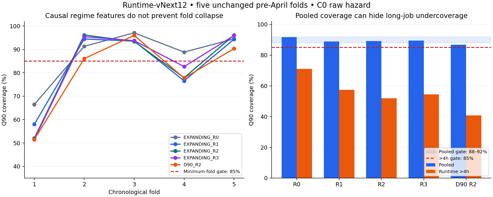

# Runtime-vNext12 최종 검토

결론: TOTAL 통과 후보0개. Stage B 종료. 최종 provider, Stage C, April 평가 미실행. 진단 anchor는 EXPANDING_R2이며 배포 선택이 아니다.
이 결론의 범위는 사전등록한5개 C0(raw hazard) 후보다. 선택적으로 허용된 C1 rolling14 보정은 평가하지 않았으며, 결과를 본 뒤 후보를 추가하지 않았다.

| Arm | Pooled Q90 | Min-fold | >4h | >12h | Q90 pinball(s) | W0 대비 GPUh | 통과 |
|---|---:|---:|---:|---:|---:|---:|---|
| EXPANDING_R0 | 91.74% | 66.47% | 71.07% | 65.56% | 4923.74 | 0.7429 | 아니오 |
| EXPANDING_R1 | 88.89% | 58.00% | 57.46% | 49.00% | 5084.29 | 0.5912 | 아니오 |
| EXPANDING_R2 | 89.16% | 52.04% | 51.97% | 43.97% | 4871.31 | 0.4941 | 아니오 |
| EXPANDING_R3 | 89.51% | 51.58% | 54.49% | 48.05% | 4902.32 | 0.4867 | 아니오 |
| D90_R2 | 86.84% | 51.47% | 40.81% | 32.90% | 5749.27 | 0.4886 | 아니오 |

## 1. V11까지 반복 실패한 가장 중요한 원인은 무엇인가?

관측된 증거는 큰 시간적 분포 변화와 긴 작업의 undercoverage다. 모델 크기·tail bin·학습창 변경만으로 해소되지 않았다. 누락된 workload 상태가 원인이라는 가설은 가능하지만 이 연구만으로 근본 원인을 확정하지 않는다.

## 2. request descriptor만으로 설명되지 않는 temporal drift 증거는 무엇인가?

V11의 fold1 TRAIN/VALID 중앙값은56/3624초, >4h 비율은3.99/44.31%였다. Fold4는74/673초,9.00/22.73%였다. V11의 공통 descriptor cell 내부 변화도 기록되어 있다. 이는 archived descriptor와 runtime 관계의 변화 증거이며 숨은 변수의 인과효과를 증명하지는 않는다.

## 3. regime feature는 정확히 무엇인가?

예측 당시 완료가 관측된 작업들의 최근 runtime 분포·장시간 비율·GPU 규모·walltime 대비 runtime 비율과 cohort 통계, 지지 표본수·fallback·관측 나이, 네 개 trend를 합친232개 변수다. R0는 기존29개 static feature만 사용한다.

## 4. regime feature는 미래정보를 읽지 않는가?

event-time 인과성 감사 통과. FUTURE_JOB_READS/FUTURE_END_READS/CURRENT_JOB_OUTCOME_READS=0. 직접 경계 검색, 무작위100개 window brute-force, 미래 outcome 변조, 초기 TRAIN prior availability를 검증했다. 별도 전체 검증에서621,583개 행×232개 feature를4개 새 프로세스로 나누어 저장 상태를 복원했고, 최초 생성과 비트 단위로 같은 값·해시를 확인했다. 실제 로그 도착 지연과 archived request 불변성은 입증하지 못했다.

## 5. 같은 timestamp의 완료 job은 어떻게 처리하는가?

`end_time < prediction_time`만 허용한다. 동일 시각 완료는 모두 제외하며 입력 행 순서와 무관하다. rolling window의 시작은 포함한다.

## 6. 7/14/30일 global runtime 통계는 어떻게 계산했는가?

[t-window,t) 완료 이력에서 Q25/50/75/90/95, >1/4/8/12/24h 비율, N, runtime×requested_GPU의 합/3600, 평균 GPU, GPU>=16 비율, runtime/walltime Q50/75/90을 계산했다. 선형 quantile과 명시적 event 경계를 사용한다. GLOBAL_REGIME_FEATURES.csv는 일별 원시 snapshot이며 전체 job별 사용 feature는 hash로 고정한 local parquet다.

## 7. cohort-specific 통계에는 무엇을 사용했는가?

partition, QoS, walltime bucket, GPU bucket, partition×QoS, partition×walltime의14/30일 통계다. N, Q50/Q90, >4h/>12h, ratio Q50을 사용했다. 목록 밖 cross와7일 cohort는 추가하지 않았다.

## 8. sparse cohort는 어떻게 fallback했는가?

cross→partition→동일 window global→global30→관측 가능한 frozen TRAIN prior 순이다. single은 partition 단계를 생략한다. global/cross N>=200, single N>=100, >4h 사건>=20, ratio 유효 표본 최소 N을 모두 요구한다. 부족한 통계를0으로 채우지 않는다. prior 최초 관측 이전은 NaN/fallback=-1이다. raw N·선택 N·신선도는 모두 기록했다.

## 9. regime feature가 fold1을 개선했는가?

R0=66.47%. EXPANDING_R1: 58.00% (-8.47pp) / EXPANDING_R2: 52.04% (-14.43pp) / EXPANDING_R3: 51.58% (-14.89pp) / D90_R2: 51.47% (-15.00pp)

## 10. regime feature가 fold4를 개선했는가?

R0=88.83%. EXPANDING_R1: 76.56% (-12.28pp) / EXPANDING_R2: 77.87% (-10.96pp) / EXPANDING_R3: 82.64% (-6.19pp) / D90_R2: 77.76% (-11.07pp)

## 11. min-fold coverage가 V9/V10/V11보다 좋아졌는가?

진단 anchor EXPANDING_R2=52.04%. 역사적 V9=80.90%, V10=39.56%, V11=66.49%. 이전 버전은 보정·선택 조건이 달라 직접 ablation 비교가 아니다. 공정한 V12 기준은 동일 fold의 R0=66.47%이며, 그 대비 변화는 -14.43pp이다. V12의 temporal robustness 개선 가설을 지지하지 못했다.

## 12. pooled Q90 coverage는?

선택 모델은 없다. 진단 anchor EXPANDING_R2의 pooled Q90=89.16%. 전체5개 arm은 아래 표와 TOTAL_MODEL_COMPARISON.csv에 기록했다. Coverage·pinball·GPUh는 동일한230,237개 exact-completed VALID 표본에서 계산한다. 미완료·관측정보 없는 행을0초 label로 만들지 않았으며, completion-selection 편향이 남을 수 있다. Proper score에는 right-censored 관측도 포함한다.

## 13. >4h coverage는?

진단 anchor 51.97%, N=38,810. 필수 기준85%를 적용했다.

## 14. >8h/>12h/>24h coverage는?

진단 anchor는 각각 48.00% / 43.97% / 27.76%. 표본수는 32,298/28,686/6,368. >24h catastrophic 기준은 사전등록한 N>=100에서70%이며 결과 후 변경하지 않았다.

## 15. 최근 long-job 비율이 실제 미래 long-job 비율과 연관되는가?

fold 시작 직전 global14의 >4h 비율과 이후 fold 비율은 Pearson0.547, Spearman0.300(N=5)이다. >12h는 Pearson0.208이다. GLOBAL14 Q90은 Pearson-0.211로 일관되게 추적한다고 볼 수 없다. Fold4 직전14일 Q90은7,207초, 이후 VALID Q90은59,862초였고 >4h 비율은8.75%/22.73%였다. 반대로 fold2의 최근 >4h 비율35.87%는 이후15.08%보다 높았다. 최근 완료 이력이 다음 기간을 일관되게 대표하지 않았다. cohort 연관성은 REGIME_FOLD_ASSOCIATION.csv에 있다. 표본이 작고 탐색적·기술적 관계다.

## 16. recent runtime/walltime ratio가 도움이 되었는가?

사전 snapshot ratio Q50의5-fold Pearson은0.924이나 Spearman은0.300이다. 모델 기여는 grouped ablation C로 판단한다: 제거 시 min-fold 48.89% (변화 -3.15pp), pinball 5306.92s (변화 +435.61s). 이 설정에서 해당 group 추가가 최저-fold coverage에 도움이 됐다. 이는 다른 feature가 있는 조건의 grouped ablation이며 인과효과 추정은 아니다.

## 17. global regime vs cohort regime 중 무엇이 기여했는가?

R0 min-fold=66.47%, R1=58.00%, R2=52.04%. global runtime 분포 제거(A): 제거 시 min-fold 52.16% (변화 +0.12pp), pinball 4869.33s (변화 -1.98s). 이 설정에서 해당 group 제거가 최저-fold coverage를 개선했다. 이는 다른 feature가 있는 조건의 grouped ablation이며 인과효과 추정은 아니다. long-rate 제거(B): 제거 시 min-fold 55.42% (변화 +3.38pp), pinball 5068.11s (변화 +196.80s). 이 설정에서 해당 group 제거가 최저-fold coverage를 개선했다. 이는 다른 feature가 있는 조건의 grouped ablation이며 인과효과 추정은 아니다. cohort 제거(D): 제거 시 min-fold 58.00% (변화 +5.96pp), pinball 5084.29s (변화 +212.98s). 이 설정에서 해당 group 제거가 최저-fold coverage를 개선했다. 이는 다른 feature가 있는 조건의 grouped ablation이며 인과효과 추정은 아니다.

## 18. trend feature는 도움이 되었는가?

R2/R3 min-fold=52.04%/51.58%, pinball=4871.31/4902.32s. Fold4는 개선했지만 최저-fold와 pinball은 개선하지 못했다. NOT_APPLICABLE_NO_TREND_IN_R2

## 19. EXPANDING과 D90 중 무엇이 나았는가?

R2에서 EXPANDING/D90의 min-fold=52.04%/51.47%, pinball=4871.31/5749.27s. 두 지표 모두 EXPANDING이 나았다. 그러나 어느 arm도 전체 gate 통과 모델로 선택하지 않았다.

## 20. V9 hazard anchor를 유지한 것이 타당했는가?

regime 정보의 추가 효과를 분리하는 고정 기준으로 타당하다. R0 전체 VALID parameter가 V9와 bit-identical하며 격자 변경은 FALSE다. 이 연구가 V9 architecture의 최적성을 증명하지는 않는다.

## 21. proper distribution score와 zero-support는 정상인가?

모든 arm에서 양의 rate·단조 누적분포·유한 interval NLL을 검증했다. 관측 interval zero-support=0. 진단 anchor interval NLL=8.168153. exact label은 반초 경계 interval likelihood, right-censored label은 log survival로 평가했다.

## 22. reservation/actual GPUh는?

진단 anchor=2.5398; W0 대비=0.4941. Q90과 W0 모두900초 slot으로 올림했다. material reduction은 W0의80% 이하로 사전등록했다.

## 23. pre-April queue utility는?

NOT_RUN_GATE_FAILED. TOTAL 통과 후보에 한해 실행하도록 지정되어 V12 queue replay를 실행하지 않았다. 예측 GPUh만으로 queue 개선을 주장하지 않는다.

## 24. TOTAL 모든 안전 gate를 통과했는가?

아니다. 통과 후보0개, SELECTED_REGIME_MODEL=NONE이다. Gate A-I는 모든 후보에 적용했으며 실패 gate를 완화하지 않았다.

## 25. TOTAL 실패 시 Stage C가 중단됐는가?

그렇다. Stage C authorization은 FALSE이며 fail-closed guard를 실행 검증한다. Remaining 모델을 학습하지 않았다.

## 26. Stage C를 실행했다면 conditional vs direct remaining 중 무엇이 나았는가?

NOT_RUN_GATE_FAILED. 비교하지 않았다.

## 27. remaining Q90 coverage는?

NOT_RUN_GATE_FAILED. 수치를 생성하지 않았다.

## 28. elapsed-age strata에서 안정적인가?

NOT_RUN_GATE_FAILED. 안정성을 평가하지 않았다.

## 29. regime state를 checkpoint 시점에도 causal하게 업데이트했는가?

일반 event_time을 받는 regime 엔진은 구현·검증했지만 RUNNING checkpoint 평가와 remaining 연결은 NOT_RUN_GATE_FAILED이다. 제출 시점 feature를 checkpoint 결과로 제시하지 않는다.

## 30. overrun은 감소했는가?

NOT_RUN_GATE_FAILED. 감소를 주장할 근거가 없다. 관측 RUNNING 유지·GPU 점유 유지·900초 연장·STAY라는 기존 계약과 V42 코드는 변경하지 않았다.

## 31. provider는 새 job에 재학습 없이 호출 가능한가?

최종 provider를 생성하지 않았으므로 V12 provider 호출 가능 상태가 아니다. FOLD_MODELS는 검증용 연구 모델이며 RUNTIME_PROVIDER/README.md는 미실행 표시만 담는다.

## 32. regime state update와 model refit의 차이는 무엇인가?

state update는 새로 완료가 관측된 job을 summary 이력에 반영하는 작업이다. model refit은 booster 가중치를 다시 학습하는 작업이다. 연구 regime 모델은 전자가 필요하고 후자는 추론에 필요하지 않다.

## 33. April을 평가했는가? 평가 조건은 무엇인가?

아니다. TOTAL 및 필요한 remaining/provider gate를 통과하고 bundle을 동결해야만 평가할 수 있다. 이번에는 Stage B에서 중단했다. April의 지위는 EXPOSED_REGRESSION_ONLY를 유지한다.

## 34. April 결과를 보고 재튜닝했는가?

NO. 이번 V12 April 평가 자체를 실행하지 않았다.

## 35. May를 열었는가?

NO. May payload·선택·평가 모두 FALSE다. 입력은 기존에 분리해 둔 pre-April parquet와 기존 fold 파일이다.

## 36. V42 research Runtime provider로 승격 가능한가?

아니다. V42_RESEARCH_RUNTIME_PROVIDER_READY=FALSE. 부정 결과를 보존하며 실패 모델로 후속 단계를 진행하지 않는다.

## 37. strict causal provider가 여전히 FALSE인 이유는?

regime outcome window의 event-time 인과성과 별개로 static request descriptor가 불변 initial-submit 값이라는 request-version authority가 없다. STRICT_CAUSAL_FEATURE_COUNT=0, REQUEST_VERSION_AUTHORITY_FOUND=FALSE, provenance_mode=Kestrel_trace_proxy를 유지한다.

재현: prepare12.py → test_regime12.py/test_contracts12.py → stage_a12.py → train12.py → full_replay12.py → plot12.py → finalize12.py → verify12.py.
기존 V6–V11 파일은 SOURCE_MANIFEST 및 DELIVERY_VERIFICATION의 SHA-256로 byte-identical을 확인한다.
