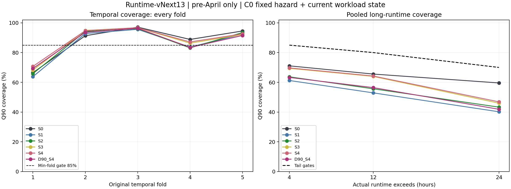

# Runtime-vNext13 최종 검토

TOTAL 통과 후보0개로 Stage B에서 종료했습니다. 최종 provider·remaining·queue replay·April 평가는 미실행입니다.
입력은 GPU 요청 작업 subset이며 전체 물리 클러스터 상태의 완전한 관측은 아닙니다. Archive 요청 값의 provenance 한계와 observation-cutoff에 따른 completion-selection 한계를 유지합니다.

## A. 확정된 primary result

6개 preregistered C0 후보와 원래 5개 temporal fold 결과를 동결했습니다. 모든 후보가 필수 gate 조합에서 실패했습니다. C1의 min-fold≥80% 및 pooled >4h≥80% 실행 조건도 충족하지 못했습니다.
S4의 pooled 91.84%는 개별 수치 gate A(88–92%)를 통과했습니다. 그러나 min-fold·long-runtime 안전 gate가 실패하여 승인 provider는 없습니다. 최종 TOTAL_OVERALL_Q90_GATE_PASS=FALSE는 사용자 지정 fail-closed 전달 판정이며, 원래 CSV의 실제 gate_A=TRUE를 변경하지 않았습니다.

| Arm | Pooled Q90 | Min-fold | >4h | >12h | >24h | Pinball(s) | W0 대비 |
|---|---:|---:|---:|---:|---:|---:|---:|
| EXPANDING_S0 | 91.74% | 66.47% | 71.07% | 65.56% | 59.58% | 4923.74 | 0.7429 |
| EXPANDING_S1 | 90.10% | 63.80% | 61.23% | 52.92% | 40.20% | 4946.82 | 0.6515 |
| EXPANDING_S2 | 90.92% | 65.86% | 63.70% | 55.66% | 43.33% | 4899.54 | 0.6687 |
| EXPANDING_S3 | 91.42% | 68.21% | 69.39% | 63.96% | 46.00% | 4774.41 | 0.6657 |
| EXPANDING_S4 | 91.84% | 70.70% | 69.72% | 64.25% | 46.88% | 4752.76 | 0.6599 |
| D90_S4 | 90.75% | 69.30% | 63.30% | 56.45% | 41.88% | 5016.58 | 0.6462 |

## B. 완료된 diagnostic ablation

A(arrival), B(pending 기본), C(running 기본), D(composition)는 각각 5개 fold를 완료했습니다. E(interaction)는 중단 지시 시 진행 중이던 fold 1·2의 저장까지 완료했습니다. 총 22개 완료 fold의 모델·예측·실측 지표를 보존했습니다. Diagnostic은 primary 후보군을 확장하거나 provider를 선택하는 데 사용하지 않았습니다.

| 제거 group | 완료 folds | Pooled Q90 | Min-fold | >4h | Pinball(s) |
|---|---|---:|---:|---:|---:|
| A | 1;2;3;4;5 | 93.05% | 77.12% | 73.32% | 4904.47 |
| B | 1;2;3;4;5 | 91.65% | 71.37% | 68.90% | 4656.20 |
| C | 1;2;3;4;5 | 90.80% | 64.79% | 64.78% | 4723.67 |
| D | 1;2;3;4;5 | 91.16% | 67.14% | 67.11% | 4822.67 |

E의 부분 결과(5-fold pooled 결과가 아님):
- fold 1: Q90 69.39%, >4h 38.04%.
- fold 2: Q90 95.37%, >4h 84.63%.

## C. Early termination 때문에 미실행된 diagnostic

E fold 3·4·5는 NOT_RUN_EARLY_TERMINATION_AFTER_PRIMARY_GATE_FAILURE입니다. E 전체 arm의 미완료 지표를 0, PASS 또는 추정값으로 채우지 않았습니다. 완료된 E fold 1·2는 별도 실측 행으로 보존했습니다.
Primary scientific verdict가 이미 결정된 뒤 남은 diagnostic만 생략한 비용 절감 결정입니다. 실행 중 작업을 강제 종료하지 않았습니다. 다음 fit의 contract 읽기를 잠금으로 차단했고 worker 종료 후 잠금을 해제했습니다. 로그의 다음 FIT 표시는 학습 호출 전 출력이며, 이어진 PermissionError는 의도한 실행 차단입니다. 과학적 학습 실패로 해석하지 않습니다. 원본 로그와 byte-identical 사본 및 local evidence hash manifest를 보존했습니다.

## D. 미실행 Stage C / provider / April / May

Stage C authorization=FALSE, remaining model=NOT_RUN, final Runtime provider=NOT_RUN, April=NOT_RUN_GATE_FAILED, May=unopened입니다. V42/CC4/MESS/kernel/optimizer/OpenDSS는 수정하거나 실행하지 않았습니다.

## 제한된 결론과 후속 가설

Current observable arrival/pending/running/composition state는 일부 fold와 일부 지표를 개선했지만, 사전 고정한 temporal robustness 및 long-runtime Q90 safety gate를 만족하지 못했다. 따라서 Runtime-vNext13은 V42 runtime provider로 승격되지 않는다. 현재 scheduler/request/current-state observable만으로는 안정적인 per-job Q90을 확립하지 못했다. 다음 연구는 새로운 정보축, 특히 workflow/application semantic information 및 join 가능한 external telemetry의 추가 가치를 별도 preregistered experiment로 평가해야 한다. 이는 추가 정보의 가치를 검증할 후속 가설이며 hidden-variable 원인을 증명한 것이 아니다. 자동으로 다음 실험이나 모델 탐색을 시작하지 않는다.

## 1. V12 completed-runtime regime feature는 왜 실패했는가?

V12는 최근 완료 작업의 runtime이 다음 workload를 일관되게 대표하지 못했다. R0/R2 min-fold는66.47%/52.04%, >4h는71.07%/51.97%였다. 새로 유입됐지만 미완료인 작업은 완료 통계에 반영되지 않는 지연이 한 가지 가능한 설명이며, 실패의 근본 원인을 확정한 것은 아니다.

## 2. current workload state는 completed regime과 무엇이 다른가?

완료된 runtime 대신 이미 관측된 제출 요청, 시작된 작업, 아직 시작되지 않은 대기 작업을 요약한다. 실제 runtime은 새 상태 변수에 들어가지 않는다.

## 3. event-sourced causal state를 어떻게 만들었는가?

archive adapter가 SUBMIT/START/END를 분리하고 dispatcher가 timestamp<t인 이벤트만 상태 엔진에 전달한다. pending/running identity map과 rolling arrival buffer·resource/category counter를 이벤트마다 갱신한다. 전체 archive의 미래 start/end 조건으로 상태를 역산하지 않는다.

## 4. 미래 START/END를 읽지 않았는가?

상태 feature의 미래 SUBMIT/START/END 읽기는 모두0이다. 무작위1,024개 시점에서 모든 미래 suffix를 교란하고 과거 SUBMIT의 GPU를 바꾼 양성 대조를 수행했다. 별도1,024개 표본에서 실제 미래 scheduling timestamp 배열 변경과 독립 event reducer도 검증했다. 스케줄러의 전달 경계 비교는 미래 payload 소비와 구분한다.

## 5. same-timestamp event order는 어떻게 정의했는가?

예측 시각과 같은 모든 이벤트를 제외한다. 이후 예측을 위해 동일 timestamp 배치를 SUBMIT→START→END, 같은 종류 내 canonical source 행 순서(submit_time, job_id)로 처리한다. 이 정렬키는 학습 전 동결한 코드에 명시되어 있으며 세부 문구는 SAME_TIMESTAMP_ORDER_CLARIFICATION.md에 설명했다. 동시 제출 cohort의 전체 크기는 읽지 않으며 관측된 same-timestamp count는0이다.

## 6. arrival-pressure feature에는 무엇이 들어가는가?

5분 제출수,15분/1h/6h/24h 제출수와 requested GPU/node/core/memory/GPU-time 합, GPU·walltime 평균/중앙값, walltime Q75/Q90, highGPU·longwall·array 비율/수, 같은 account/QoS/partition의 최근 제출수, 이전 관측 제출 이후 시간이다.

## 7. PENDING state를 어떻게 정의했는가?

SUBMIT이 처리됐고 START가 처리되지 않은 identity 집합이다. 관측 END가 pending을 종료할 수도 있다. 요청량·구성·관측 submit 기준 나이를 집계하며 미래 시작 시각은 저장하지 않는다.

## 8. RUNNING state를 어떻게 정의했는가?

START가 처리되고 END가 아직 처리되지 않은 identity 집합이다. 요청 GPU/node/core/memory, 관측 START로부터 경과시간, 구성과 같은 account 수를 집계한다.

## 9. 현재 running GPU는 미래 end 없이 어떻게 계산했는가?

START 처리 시 running map과 자원 합에 더하고 END 처리 시 제거한다. 미래 END가 없거나 아직 도착하지 않은 작업은 계속 running으로 남는다. GPU는 실제 점유 센서가 아닌 archived requested GPU의 연구 proxy다.

## 10. Fold1에서 current state가 runtime shift를 설명하는 신호가 있었는가?

INCONCLUSIVE. 24h arrival GPU합: 14일 전 1248 → VALID 직전 1543 / pending GPU: 14일 전 970 → VALID 직전 0 / running GPU: 14일 전 457 → VALID 직전 294. 다음 VALID runtime Q90=70506s, >4h 비율=44.31%. 압력 변화는 관측되지만 이것만으로 runtime shift 추적을 입증하지 않는다.

## 11. Fold4에서는 어떠한가?

INCONCLUSIVE. 24h arrival GPU합: 14일 전 2109 → VALID 직전 1757 / pending GPU: 14일 전 575 → VALID 직전 637 / running GPU: 14일 전 385 → VALID 직전 588. 다음 VALID runtime Q90=59862s, >4h 비율=22.73%. 압력 변화는 관측되지만 이것만으로 runtime shift 추적을 입증하지 않는다.

## 12. S0 static baseline coverage는?

EXPANDING_S0: pooled 91.74%, min-fold 66.47%, >4h 71.07%, fold 표준편차 10.95pp.

## 13. S1 arrival features 추가 결과는?

EXPANDING_S1: pooled 90.10%, min-fold 63.80%, >4h 61.23%, fold 표준편차 11.65pp.

## 14. S2 pending state 추가 결과는?

EXPANDING_S2: pooled 90.92%, min-fold 65.86%, >4h 63.70%, fold 표준편차 11.28pp.

## 15. S3 running state 추가 결과는?

EXPANDING_S3: pooled 91.42%, min-fold 68.21%, >4h 69.39%, fold 표준편차 10.33pp.

## 16. S4 composition/interactions 추가 결과는?

EXPANDING_S4: pooled 91.84%, min-fold 70.70%, >4h 69.72%, fold 표준편차 9.40pp.

## 17. 어떤 state family가 min-fold를 개선했는가?

S0→S1: min-fold -2.67pp. S1→S2: min-fold +2.05pp. S2→S3: min-fold +2.36pp. S3→S4: min-fold +2.49pp. A(arrival) 제거: min-fold 변화 +6.42pp, pinball 변화 +151.71s; B(pending 기본) 제거: min-fold 변화 +0.67pp, pinball 변화 -96.56s; C(running 기본) 제거: min-fold 변화 -5.91pp, pinball 변화 -29.09s; D(composition) 제거: min-fold 변화 -3.56pp, pinball 변화 +69.91s; E: NOT_RUN_EARLY_TERMINATION_AFTER_PRIMARY_GATE_FAILURE; 완료 fold 1;2, 미실행 fold 3;4;5. 부분 fold 실측값은 ABLATION_FOLD_METRICS.csv에 보존하며 전체 arm 지표는 산출하지 않음. 제거 시 min-fold가 낮아져 조건부 기여가 확인된 block은 running 기본, composition. 그룹 범위는 ABLATION_SCOPE.md를 따른다. 인과효과를 뜻하지 않는다.

## 18. pooled Q90 coverage는?

선택 모델은 없다. 진단 anchor EXPANDING_S4의 pooled=91.84%. 모든 모델은 동일 exact-completed VALID 230,237개로 coverage/오차를 비교하며, right-censored 표본은 proper likelihood에 포함한다.

## 19. min-fold coverage는?

진단 anchor 70.70%. 최대 fold=96.74%, 표준편차=9.40pp. 필수 최소 기준은85%다.

## 20. >4h coverage는?

진단 anchor 69.72%, N=38,810. 필수85% 기준을 완화하지 않았다.

## 21. >12h/>24h coverage는?

진단 anchor >12h=64.25% (N=28,686), >24h=46.88% (N=6,368). 각각80%, N≥100에서70% 기준을 적용했다.

## 22. reservation/actual GPUh는?

진단 anchor reservation/actual GPUh=3.3921, W0 대비=0.6599. Q90과 W0는900초 slot 올림이며 W0 대비≤0.80을 material reduction으로 고정했다. 양의 runtime에서 Q90/runtime 중앙값=9.9136, P90=4625.7190; zero-runtime=1,290개는 ratio에서 제외했다.

## 23. pinball과 Q50 MAE는?

진단 anchor Q90 pinball=4752.76s, Q50 MAE=23669.12s. S0는 각각4923.74s/18835.72s다. Proper interval NLL=8.071580, C0의 zero-support 관측 interval은0이다.

## 24. state feature를 추가했는데 short-job overreservation은 늘었는가?

진단 anchor의 short-job overreservation은 S0보다 줄었다. 0<runtime≤1h short job의 slot-rounded 예약 GPUh/실제 GPUh로 사전 정의했다. EXPANDING_S0 75.24배 / EXPANDING_S1 69.28배 / EXPANDING_S2 71.33배 / EXPANDING_S3 69.86배 / EXPANDING_S4 70.58배 / D90_S4 69.33배. 이 비율에는900초 slot 올림 자체의 영향도 포함된다. 모든 후보에 같은 규칙을 적용하며 coverage만 높고 예약이 큰 모델을 성공으로 보지 않는다.

## 25. current-state feature가 실제 temporal robustness를 개선했는가?

전체 안전 기준을 충족하는 안정적 개선은 입증하지 못했다. 진단 anchor 대비 S0의 min-fold 변화는 +4.23pp, >4h 변화는 -1.36pp이다. 일부 지표 개선과 전체 가설 검증 성공은 구분한다.

## 26. D90이 EXPANDING보다 나았는가?

D90은 min-fold 기준으로 더 낫지 않았다. S4의 EXPANDING/D90 min-fold=70.70%/69.30%, >4h=69.72%/63.30%, pinball=4752.76/5016.58s. 어느 쪽도 전체 gate를 통과하지 못했다.

## 27. C1 rolling14 보정까지 실행했는가? 실행 조건은 충족했는가?

실행하지 않았다. 어느 C0도 min-fold≥80%와 pooled >4h≥80%를 동시에 만족하지 않아 사전 조건을 충족하지 못했다.

## 28. TOTAL 모든 안전 gate를 통과했는가?

아니다. 모든 gate를 통과한 후보0개, SELECTED_STATE_SET=NONE, TOTAL_RUNTIME_MODEL_VALIDATED=FALSE다. 진단 anchor는 provider 선택이 아니다.

## 29. TOTAL 실패 시 Stage C가 중단됐는가?

그렇다. STAGE_C_AUTHORIZED=FALSE이며 fail-closed guard도 검증했다. Remaining 학습과 최종 provider 생성을 실행하지 않았다.

## 30. Stage C를 실행했다면 REM_A vs REM_B 중 무엇이 나았는가?

NOT_RUN_GATE_FAILED. REM_A/REM_B를 비교하지 않았다.

## 31. remaining Q90 coverage는?

NOT_RUN_GATE_FAILED. Remaining coverage 수치를 생성하지 않았다.

## 32. checkpoint state도 미래정보 없이 재구성했는가?

NOT_RUN_GATE_FAILED. 일반 상태 엔진의 임의 시각 replay는 검증했지만 remaining checkpoint 표본·모델 실험은 하지 않았다. 누수 count0은 데이터 미생성을 뜻하며 checkpoint 성능이나 인과성 검증 성공이 아니다.

## 33. overrun은 감소했는가?

NOT_RUN_GATE_FAILED. queue/stress replay를 실행하지 않아 감소를 주장하지 않는다. V42의 관측 RUNNING 유지, GPU 점유 유지,900초 연장, STAY fallback은 그대로다.

## 34. provider current-state engine은 restart 후 동일한가?

연구 상태 엔진은 621,583개 예측행×163개 feature에서 연속 재생과4개 새 프로세스의 저장/복원 재생이 bit-identical하다. 연구 fold 모델의 재로드 예측도 검증한다. 최종 provider는 생성하지 않았으므로 provider 승인으로 해석하지 않는다.

## 35. online ML refit이 필요한가?

아니다. ONLINE_MODEL_REFIT_REQUIRED=FALSE다. 연구 상태 모델을 추론하려면 관측 이벤트에 따른 state update가 필요하지만 booster 파라미터는 고정된다. 최종 flag의 state-update-required=FALSE는 선택 provider가 없다는 범위다.

## 36. April을 평가했는가? 이유는?

아니다. TOTAL와 필요한 remaining 검증, provider bundle 동결을 선행해야 하지만 TOTAL에서 실패했다. APRIL_STATUS=NOT_RUN_GATE_FAILED다. EXPOSED_REGRESSION_ONLY는 이전의 자료 지위이며 평가 실행을 뜻하지 않는다.

## 37. April을 보고 재튜닝했는가? 반드시 NO.

NO. April을 평가하거나 선택·튜닝에 사용하지 않았다.

## 38. May를 열었는가? 반드시 NO.

NO. May payload·선택·평가 모두 FALSE다. 입력은 이전에 분리된 pre-April parquet와 고정 fold 파일뿐이다.

## 39. V42 research provider로 승격 가능한가?

아니다. V42_RESEARCH_RUNTIME_PROVIDER_READY=FALSE다. 기준을 낮추거나 실패 후보를 provider로 승격하지 않았다.

## 40. strict causal provider가 여전히 FALSE인 이유는?

event-time 인과성과 request provenance는 별개다. Archived requested walltime/GPU/QoS 등의 immutable original-submit authority가 없어 STRICT_CAUSAL_FEATURE_COUNT=0, REQUEST_VERSION_AUTHORITY_FOUND=FALSE, STRICT_CAUSAL_RUNTIME_PROVIDER_READY=FALSE를 유지한다.

## 41. current-state 가설도 실패한다면 무엇을 의미하는가?

Current observable arrival/pending/running/composition state는 일부 fold와 일부 지표를 개선했지만, 사전 고정한 temporal robustness 및 long-runtime Q90 safety gate를 만족하지 못했다. 따라서 Runtime-vNext13은 V42 runtime provider로 승격되지 않는다. 현재 scheduler/request/current-state observable만으로는 안정적인 per-job Q90을 확립하지 못했다. 다음 연구는 새로운 정보축, 특히 workflow/application semantic information 및 join 가능한 external telemetry의 추가 가치를 별도 preregistered experiment로 평가해야 한다. 이는 추가 정보의 가치를 검증할 후속 가설이며 hidden-variable 원인을 증명한 것이 아니다. 자동으로 다음 실험이나 모델 탐색을 시작하지 않는다.

최종화 재현 순서(학습 없음): 보존된 .local evidence 준비 → collect_final13.py → finalize13.py → verify13.py. train13.py는 실행하지 않습니다.
원래 연구 실행 이력은 prepare13.py → test_state13.py → stage_a13.py → independent_audit13.py → train13.py의 primary와 완료 diagnostic → 사용자 조기 종료입니다. 동결된 train13.py는 연구 이력 보존용이며 재실행하면 미실행 진단을 학습할 수 있으므로 이번 전달 검증에서 실행하지 않습니다.
원시 입력·중간 feature·개별 예측은 SOURCE_MANIFEST 및 LOCAL_EVIDENCE_MANIFEST와 .local 파일로 고정하며 Git에는 대용량 local 파일을 포함하지 않습니다. 원본 실행 로그의 동일 바이트 사본은 EXECUTION_LOGS에 포함합니다. 기존 V9 .local 입력 파일도 manifest 해시와 일치해야 합니다. prepare13.py는 기존 PREREGISTRATION.json 덮어쓰기를 거부합니다.
