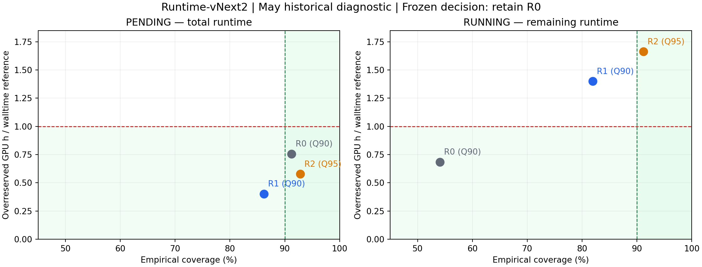

# Runtime-vNext2 최종 검토 — Q90 vs Q95 operational bound

**Pending과 Running 모두 R0 유지로 freeze했다. Q95를 채택하지 않는다.** Q90과 Q95 어느 후보도 DEVELOPMENT와 CALIBRATION 양쪽의 필수 coverage·과예약 조건을 통과하지 못했다. May 결과로 선택을 바꾸지 않았다.

이번 작업은 May exposure 이후의 후속 model-development 실험이다. May 및 기존 April evaluation은 historical diagnostic이며 untouched confirmation이 아니다. PR65의 고정 `MULTI_QUANTILE` 예측을 그대로 재사용했다. temporal policy는 180일 history, 14일 recency half-life, 기존 issue마다 refit인 채로 보존됐고, 이번 실행에서 새 학습은 0회이다. 새로운 architecture·feature·hyperparameter·quantile 탐색이나 residual calibration은 없었다.

## 비교와 selection freeze

- R0: 최신 frozen production `ROLLING_Q90_TRACK_P_L2` Q90. Pending은 total runtime이며 Running은 `max(total-elapsed,0)`의 naive remaining reference이다. Running R0를 학습된 remaining 모델이라고 주장하지 않는다.
- R1: PR65 MULTI_QUANTILE **Q90**. Pending total / Running elapsed-conditioned remaining.
- R2: 같은 구조와 같은 fit의 **Q95**. Q95를 Q90으로 재명명하지 않았다.

상태별로 DEV와 CAL **각각** coverage ≥90%, overreserved GPU·h < requested-walltime reference를 만족해야 후보가 된다. 후보 중 GPU coverage ≥90% 및 long-job underprediction ≤15%를 양쪽에서 만족하는 경우를 우선하고, 그다음 낮은 quantile을 택한다. 후보가 없으면 R0 유지다. 최신 R0는 DEV/CAL에서 검증 가능한 artifact가 없어 해당 시기로 역적용하지 않았다. R0 대비 missed-slot 개선은 May diagnostic에서만 보고하며 selection에 사용하지 않았다. R0 유지 판정은 R0가 모든 gate를 충족한다는 뜻이 아니다.

등록 시각: `2026-09-26T15:36:27.236457+00:00`. 선택 freeze: `2026-09-26T15:36:28.860737+00:00`. 평가 완료: `2026-09-26T15:36:44.907352+00:00`.

| role | state | arm | coverage | GPU_coverage | long_under | overreserve_vs_requested |
|---|---|---|---|---|---|---|
| CALIBRATION | PENDING | R1 | 0.7407 | 0.8871 | 0.4483 | 0.1996 |
| CALIBRATION | RUNNING | R1 | 0.7428 | 0.8461 | 0.2396 | 2.3562 |
| CALIBRATION | PENDING | R2 | 0.7921 | 0.9119 | 0.3148 | 0.2831 |
| CALIBRATION | RUNNING | R2 | 0.9366 | 0.9495 | 0.0628 | 2.4960 |
| DEVELOPMENT | PENDING | R1 | 0.8943 | 0.8945 | 0.2146 | 0.1940 |
| DEVELOPMENT | RUNNING | R1 | 0.8192 | 0.8147 | 0.1953 | 1.0180 |
| DEVELOPMENT | PENDING | R2 | 0.9622 | 0.9456 | 0.0907 | 0.3097 |
| DEVELOPMENT | RUNNING | R2 | 0.8703 | 0.8615 | 0.1400 | 1.1745 |

Q95 Pending은 DEV coverage 96.22%지만 CAL 79.21%로 탈락했다. Q95 Running은 DEV coverage 87.03%이며 DEV/CAL 과예약이 walltime reference의 1.17/2.50배로 탈락했다. Q90도 필수 조건을 충족하지 못했다.

## May historical diagnostic

coverage 및 long_under는 비율, GPU-slots는 15분 GPU-slot 누적 수, reserve는 GPU·h, pinball은 초 단위 평균이다. 아래 표는 각각의 동일 Job-issue 모집단으로 직접 비교한다.

| state | arm | nominal_quantile | N | coverage | GPU_coverage | long_under | missed_GPU_slots |
|---|---|---|---|---|---|---|---|
| PENDING | R0 | 0.9000 | 40419 | 0.9122 | 0.9370 | 0.2260 | 17,373.0000 |
| RUNNING | R0 | 0.9000 | 7073 | 0.5406 | 0.5635 | 0.4877 | 136,902.0000 |
| PENDING | R1 | 0.9000 | 40419 | 0.8621 | 0.8872 | 0.3140 | 168,563.0000 |
| RUNNING | R1 | 0.9000 | 7073 | 0.8195 | 0.8153 | 0.1928 | 42,242.0000 |
| PENDING | R2 | 0.9500 | 40419 | 0.9280 | 0.9383 | 0.1621 | 141,342.0000 |
| RUNNING | R2 | 0.9500 | 7073 | 0.9122 | 0.8949 | 0.0936 | 16,467.0000 |

| state | arm | overreserved_GPUh | requested_overreserved_GPUh | reserved_GPUh | requested_reserved_GPUh | reserve_vs_requested | pinball_Q90 | pinball_Q95 |
|---|---|---|---|---|---|---|---|---|
| PENDING | R0 | 1,720,482.8264 | 2,273,332.5769 | 2,198,873.9285 | 2,774,467.5333 | 0.7925 | 2,827.7576 | 1,681.4371 |
| RUNNING | R0 | 137,364.8506 | 200,667.5656 | 349,553.0882 | 512,235.5378 | 0.6824 | 32,197.5137 | 32,940.4318 |
| PENDING | R1 | 913,441.1510 | 2,273,332.5769 | 1,338,883.0431 | 2,774,467.5333 | 0.4826 | 3,576.9489 | 2,846.5987 |
| RUNNING | R1 | 280,850.4448 | 200,667.5656 | 554,706.1215 | 512,235.5378 | 1.0829 | 15,114.6847 | 12,700.4218 |
| PENDING | R2 | 1,312,236.7011 | 2,273,332.5769 | 1,761,626.0368 | 2,774,467.5333 | 0.6349 | 3,425.0264 | 2,512.1121 |
| RUNNING | R2 | 333,653.8458 | 200,667.5656 | 627,822.9558 | 512,235.5378 | 1.2257 | 10,499.7703 | 7,194.2922 |

Q95 Pending은 coverage 92.80%, GPU coverage 93.83%로 올라가지만 long-job underprediction 16.21%는 선호 기준을 넘고, missed GPU-slots 141,342는 R0의 17,373보다 많다(713.57% 증가). Q95 Running은 coverage 91.22%, long-job underprediction 9.36%이고 R0 대비 missed slots가 87.97% 감소한다. 하지만 GPU coverage 89.49%는 90%에 못 미치며, 과예약 333,653.85 GPU·h는 walltime reference 200,667.57의 **1.66배**다. 안전성 증가만으로 과예약 실패를 무시하지 않는다.

## Paired day/block bootstrap

동일 Job-issue를 pair로 유지하고 관측 issue-day 단위 bootstrap 및 chronological circular 7-issue block bootstrap을 각각 2,000회 수행했다(seed 20260927). coverage, GPU coverage, long under, missed slots, 과예약, 총 reserve, requested 대비 reserve 비율, 두 pinball을 각 resample의 집계값에서 다시 계산했다. 아래 delta는 **candidate − reference**다. 양수 coverage는 개선, 양수 loss/underprediction/slots/reserve는 증가다. 원본 전체 CI는 `PAIRED_UNCERTAINTY.csv`에 있다.

| state | candidate | reference | metric | delta | CI95_low | CI95_high |
|---|---|---|---|---|---|---|
| PENDING | R2 | R1 | coverage | 0.0658 | 0.0479 | 0.0825 |
| PENDING | R2 | R1 | GPU_coverage | 0.0510 | 0.0312 | 0.0687 |
| PENDING | R2 | R1 | long_under | -0.1519 | -0.1988 | -0.0907 |
| PENDING | R2 | R1 | missed_GPU_slots | -27,221.0000 | -41,167.2500 | -13,641.3750 |
| PENDING | R2 | R1 | overreserved_GPUh | 398,795.5501 | 36,408.8374 | 976,620.9344 |
| PENDING | R2 | R1 | pinball_Q90 | -151.9224 | -291.9244 | 258.6529 |
| PENDING | R2 | R1 | pinball_Q95 | -334.4866 | -439.7415 | -178.0042 |
| PENDING | R2 | R0 | coverage | 0.0158 | -0.0241 | 0.0677 |
| PENDING | R2 | R0 | GPU_coverage | 0.0013 | -0.0267 | 0.0422 |
| PENDING | R2 | R0 | long_under | -0.0639 | -0.1353 | 0.0588 |
| PENDING | R2 | R0 | missed_GPU_slots | 123,969.0000 | 36,773.6500 | 198,002.4250 |
| PENDING | R2 | R0 | overreserved_GPUh | -408,246.1252 | -726,905.4537 | -115,898.0934 |
| PENDING | R2 | R0 | pinball_Q90 | 597.2688 | -665.3573 | 1,702.6178 |
| PENDING | R2 | R0 | pinball_Q95 | 830.6750 | -446.9819 | 1,963.1391 |
| RUNNING | R2 | R1 | coverage | 0.0927 | 0.0386 | 0.1686 |
| RUNNING | R2 | R1 | GPU_coverage | 0.0796 | 0.0386 | 0.1324 |
| RUNNING | R2 | R1 | long_under | -0.0992 | -0.1854 | -0.0405 |
| RUNNING | R2 | R1 | missed_GPU_slots | -25,775.0000 | -53,110.1500 | -5,908.9750 |
| RUNNING | R2 | R1 | overreserved_GPUh | 52,803.4010 | 33,251.4700 | 73,401.5525 |
| RUNNING | R2 | R1 | pinball_Q90 | -4,614.9143 | -10,643.4357 | -116.6381 |
| RUNNING | R2 | R1 | pinball_Q95 | -5,506.1295 | -12,034.9822 | -609.0188 |
| RUNNING | R2 | R0 | coverage | 0.3716 | 0.3209 | 0.4614 |
| RUNNING | R2 | R0 | GPU_coverage | 0.3314 | 0.2879 | 0.3787 |
| RUNNING | R2 | R0 | long_under | -0.3941 | -0.4984 | -0.3391 |
| RUNNING | R2 | R0 | missed_GPU_slots | -120,435.0000 | -174,662.8000 | -79,744.7000 |
| RUNNING | R2 | R0 | overreserved_GPUh | 196,288.9952 | 164,607.8321 | 233,191.5246 |
| RUNNING | R2 | R0 | pinball_Q90 | -21,697.7434 | -50,072.1357 | -3,142.0707 |
| RUNNING | R2 | R0 | pinball_Q95 | -25,746.1395 | -56,447.8359 | -5,714.8927 |

CI는 이미 노출된 과거 기간에 대한 조건부 불확실성이다. 오래 지속되는 Job이 여러 issue에 반복되어 7개 issue를 넘는 dependence가 남을 수 있다. April에는 관측하지 않은 날짜가 있으므로 block_days=7은 달력 7일이 아니라 관측 issue 7개다. 통계적으로 안전성 개선이 보여도 DEV/CAL 탈락이나 과예약 실패를 뒤집지 않는다.

## Pending/Running 및 label/maturity audit

Pending target은 실행 대기시간을 제외한 total runtime이며, Running target은 issue부터 종료까지의 remaining runtime이다. Running에는 이미 검증된 log1p(elapsed) feature와 고정 landmark 학습 membership을 사용했다. long-job은 **actual total runtime >4h**로 정의하고 해당 상태의 target에 대한 underprediction을 계산한다. elapsed strata `<1h / 1–2h / 2–4h / 4–8h / >8h`는 `RUNNING_ELAPSED_METRICS.csv`에 모두 보고한다.

67개 inherited issue의 전체 positive-GPU query membership과 training membership을 다시 구성해 NPZ row IDs와 정확히 일치하는지 검증했다. 학습은 `job_end_time < issue_time` 및 180일 lower bound를 지키며 Running landmark Job-ID hash와 support도 재검증했다. 부모의 raw prediction hash와 동일한 Q90/Q95만 읽었고 fit weight를 변경하지 않았다. 67개 issue의 prediction receipt는 새 label join 전에 생성된 부모 증거이다. exact ID 목록은 부모 `JOB_MEMBERSHIP.parquet`, `ISSUE_MEMBERSHIP.parquet`, `fits/LGBM_180_14/*/train_membership.npz`에 그대로 있으며 신규 `CAUSAL_MEMBERSHIP_LEDGER.csv`가 상대경로와 hash를 고정한다.

원본 DEV Pending의 invalid-label 2개는 query membership에서 보존하고 unscorable_N=2로 명시한다. 나머지 DEV/CAL 및 모든 평가 label은 scorable이며, 임의 exclusion은 없다. feature availability는 submit/start event-time proxy에서 검증했으나 historical request 수정 이력과 ingestion/version provenance는 여전히 미확인이다. 따라서 운영 인과성 인증이나 production 승격 근거가 될 수 없다. 완료된 Job만의 학습에 따른 completion selection bias도 부모와 동일하다.

GPU-slots는 runtime-origin 24시간의 predicted-finished/actually-active **proxy**이며 실제 dispatch나 optimizer 출력이 아니다. Pending은 queue wait를 포함하지 않는다. reserve reference는 Pending requested walltime, Running `max(requested-elapsed,0)`이다. 음수 bound repair와 monotone quantile ordering은 부모의 고정 생성 방식이며 이번 실험은 scaling/capping을 추가하지 않았다.

## 최종 판정

```text
TEMPORAL_POLICY_CHANGED = FALSE
NEW_ARCHITECTURE_SEARCHED = FALSE
PRODUCTION_REPLACEMENT_SUPPORTED = FALSE
OPTIMIZER_INTEGRATION_READY = FALSE
PRODUCTION_PROMOTED = FALSE
```

target/interface는 명시된 offline proxy 범위에서 유효하다. 이번에 temporal 효과나 새 architecture 우월성을 시험하지 않았다. 선택 후보가 없어 운영 교체를 지지하지 않으며, May의 일부 안전성 개선도 requested-walltime 대비 과예약과 Pending missed slots 실패를 해결하지 못한다. PR64/65 기존 frozen evidence를 덮어쓰지 않았다. optimizer/MESS/IEEE123/8500/Actual/OpenDSS를 수정하거나 실행하지 않았다.

## 재현·검증 산출물

- `REGISTRATION.json`, `FINAL_SELECTION_FREEZE.json`: 선택 규칙, split/metric 정의와 결정 시각, source hash.
- `DEVELOPMENT_CALIBRATION_METRICS.csv`, `MODEL_METRICS.csv`, `RUNNING_ELAPSED_METRICS.csv`: 상태별 전체 지표.
- `BOUND_PREDICTIONS.parquet`: 이름과 nominal quantile이 보존된 모든 평가 bound·label.
- `PAIRED_UNCERTAINTY.csv`, `MATCHED_COMPARISONS.csv`: paired CI 및 R0/후보 비교.
- `CAUSAL_MEMBERSHIP_LEDGER.csv`, `VALIDATION.json`, `PARENT_PRESERVATION_START/END.json`: 정확한 inherited membership과 부모 무결성.
- `TEST_RECEIPT.json`, `SCIENTIFIC_REVIEW.json`, `DELIVERY_MANIFEST.json`: 단위 검증, 독립 검토, byte-level 배포 seal.



독립 검토의 missing preference 지표 처리 한계와 보완 검증은 [검토 addendum](REVIEW_ADDENDUM_KO.md)에 공개했다. 실제 선택 지표는 모두 finite이며 frozen 선택에 영향이 없다. 별도 guard가 이를 fail-closed로 확인한다. 감소율 CI는 `MISSED_SLOT_REDUCTION_UNCERTAINTY.csv`에서 확인한다. May Q95 대비 R0의 7-issue block 감소율 CI는 Pending −20.2771~−1.5382, Running 0.8016~0.9736이다(비율 단위, 음수는 증가).
