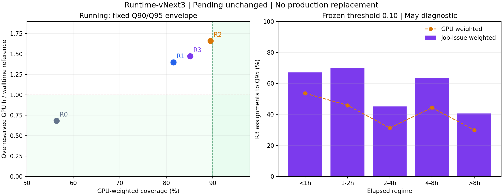

# Runtime-vNext3 최종 검토 — Adaptive Running bound

**Pending은 frozen production R0를 그대로 유지한다. Running adaptive R3도 production 교체를 지지하지 않는다.** R3는 Q95 대비 과예약을 줄였지만 coverage도 함께 낮아져 동일 안전성에서 reserve를 줄였다는 주장을 할 수 없다.

이번 연구는 May 노출 이후의 후속 model-development이다. April/May는 historical diagnostic이며 untouched confirmation이 아니다. underlying runtime은 PR65 MULTI_QUANTILE, 180일 history, 14일 recency half-life, 기존 issue별 refit 상태 그대로이고 새 runtime 학습은 0회이다. 별도로 고정된 하나의 logistic risk selector만 causal history에서 학습했다. `NEW_ARCHITECTURE_SEARCHED=FALSE`는 underlying runtime architecture search를 하지 않았다는 뜻이며 selector 학습을 숨기는 표현이 아니다.

## 고정 selector와 사전 선택

Selector는 `P(actual remaining > inherited Q90)`를 추정하는 하나의 고정 standardized logistic regression이다(C=1, lbfgs, max_iter=5000, class_weight 없음). 이전 issue에서 나온 Running OOS 예측 중 **issue가 과거이고 job_end_time도 현재 issue보다 엄격히 이른** 완료 Job만 쓴다. Job별 최신 관측 하나로 중복 support를 제거한다. 최소 100개 Job 및 각 class 10개 미만이면 risk=0으로 Q90을 선택한다. 첫 TRAIN issue 1개만 fallback이며 나머지 66개는 selector를 학습했다.

Feature는 Q95−Q90 spread와 Q90으로 정규화한 spread, elapsed, elapsed/requested, remaining requested, GPU count, hardware/standby, elapsed regime뿐이다. log transform과 범주 schema는 사전 고정했고 standardization은 해당 issue 이전 training만으로 fit했다. 실제 remaining/total runtime과 종료시각은 feature가 아니다. [source](study.py), [등록](REGISTRATION.json), [feature/maturity audit](VALIDATION.json)에 명세와 검증을 저장했다.

Threshold grid 0.1–0.9를 사전등록한 뒤 DEV/CAL의 Running만으로 선택했다. 양 split에서 coverage≥90%, GPU coverage≥90%, long-under≤15%를 충족하는 후보를 우선하고, 이 중 walltime 이하의 과예약을 선호하며 reserve가 작은 후보를 택한다. 아무 후보도 safety를 통과하지 못하면 사전 정의 normalized safety deficit가 가장 작은 threshold를 research candidate로만 고정한다. 모든 선택 지표의 finite 여부를 fail-closed 검증한다.

등록 `2026-09-26T15:53:01.217754+00:00`, freeze `2026-09-26T15:53:05.212523+00:00`, 평가 완료 `2026-09-26T15:53:35.834387+00:00`. **R3 threshold=0.10**로 freeze했다. operational adoption은 R0 유지이며 평가 후 변경하지 않았다.

| role | threshold | coverage | GPU_coverage | long_under | overreserve_vs_requested | Q95_fraction |
|---|---|---|---|---|---|---|
| CALIBRATION | 0.1000 | 0.9359 | 0.9492 | 0.0636 | 2.4489 | 0.7203 |
| DEVELOPMENT | 0.1000 | 0.8668 | 0.8552 | 0.1439 | 1.1158 | 0.7347 |

DEV coverage 86.68%, GPU coverage 85.52%로 safety가 실패했고, DEV/CAL 과예약은 walltime 대비 1.12/2.45배다. CAL만의 개선으로 DEV 실패를 무시하지 않았다. 최신 R0는 DEV/CAL 및 April에서 검증 가능한 artifact가 없어 역방향 replay를 하지 않았다. R0 대비 missed-slot 감소는 May diagnostic에서만 보고하며 threshold 선택에 사용하지 않았다.

## 비교 정의와 Pending 보존

- R0: frozen production Q90. Running은 고정 total-runtime 예측에서 elapsed를 뺀 naive remaining reference이며 학습된 remaining 모델이 아니다.
- R1: Pending R0 그대로, Running inherited elapsed-conditioned Q90.
- R2: Pending R0 그대로, Running inherited elapsed-conditioned Q95.
- R3: Pending R0 그대로, Running risk≥0.10이면 **정확히 Q95**, 아니면 **정확히 Q90**.

R3는 adaptive operational bound이다. 행의 `nominal_quantile`은 선택한 원본 bound의 Q90/Q95 출처를 뜻하며 R3 전체가 어떤 고정 quantile로 calibration되었다고 주장하지 않는다. Q95를 Q90으로 재명명하지 않았고 scaling/capping은 없다. 두 pinball(.90/.95)은 모든 bound에 대해 별도로 계산했다.

May Pending 40,419개 Job-issue에서 R1/R2/R3의 bound가 R0와 bit-exact함을 검증했다. Pending에 새 모델, quantile 선택 또는 selector를 적용하지 않았다. DEV/CAL/April의 현재 production Pending artifact가 없어 그 기간 Pending 성능을 만들지 않았다. May Pending의 모든 arm은 coverage 91.22%, GPU coverage 93.70%, long under 22.60%, missed slots 17,373으로 동일하다. R0 유지가 R0 자체의 모든 gate 충족을 뜻하지 않는다.

## May Running historical diagnostic

coverage/long_under는 비율, reserve는 GPU·h, pinball은 초 단위 평균이다. 모든 arm은 동일한 7,073개 Running Job-issue다.

| arm | N | coverage | GPU_coverage | long_under | missed_GPU_slots | Q95_fraction | Q95_GPU_fraction |
|---|---|---|---|---|---|---|---|
| R0 | 7073 | 0.5406 | 0.5635 | 0.4877 | 136,902.0000 | 0.0000 | 0.0000 |
| R1 | 7073 | 0.8195 | 0.8153 | 0.1928 | 42,242.0000 | 0.0000 | 0.0000 |
| R2 | 7073 | 0.9122 | 0.8949 | 0.0936 | 16,467.0000 | 1.0000 | 1.0000 |
| R3 | 7073 | 0.8759 | 0.8514 | 0.1329 | 25,803.0000 | 0.4953 | 0.3560 |

| arm | overreserved_GPUh | requested_overreserved_GPUh | reserved_GPUh | reserve_vs_requested | overreserve_vs_requested | pinball_Q90 | pinball_Q95 |
|---|---|---|---|---|---|---|---|
| R0 | 137,364.8506 | 200,667.5656 | 349,553.0882 | 0.6824 | 0.6845 | 32,197.5137 | 32,940.4318 |
| R1 | 280,850.4448 | 200,667.5656 | 554,706.1215 | 1.0829 | 1.3996 | 15,114.6847 | 12,700.4218 |
| R2 | 333,653.8458 | 200,667.5656 | 627,822.9558 | 1.2257 | 1.6627 | 10,499.7703 | 7,194.2922 |
| R3 | 295,973.4818 | 200,667.5656 | 581,002.0636 | 1.1342 | 1.4749 | 12,311.4828 | 9,529.3172 |

R3는 R0 대비 missed slots를 81.15% 줄이고 long-under 13.29%를 달성한다. 그러나 coverage 87.59%, GPU coverage 85.14%로 목표를 못 채우며 overreserve 295,973.48 GPU·h는 walltime reference의 1.475배다. Q95를 전체의 49.53%(GPU 가중 35.60%)에 적용했다.

R2 Q95 대비 overreserve는 37,680.36 GPU·h 감소하지만 coverage는 3.63pp, GPU coverage는 4.35pp 낮아지고 missed slots는 9,336 증가한다. 안전성 손실을 숨긴 reserve 절약으로 채택하지 않는다.

## Pointwise feasibility envelope

각 Job-issue에서 `Q90 ≤ R3 ≤ Q95`이므로 coverage indicator는 Q95를 넘지 못하고 `max(bound−actual,0)` 과예약은 Q90보다 작아질 수 없다. GPU 가중치도 양수이므로 집계에도 같은 부등식이 성립한다.

May에서는 **Q95 GPU coverage 89.4945%가 모든 binary selector의 상한**이라 목표 90%에 도달할 수 없다. 또한 **Q90 overreserve 280,850.44 GPU·h가 하한**이며 walltime reference 200,667.57 GPU·h의 1.3996배다. 따라서 고정된 Q90/Q95 중 하나를 고르는 이 범위 안에서는 두 목표를 동시에 충족할 수 없다. 이 사실은 노출된 May에 대한 수학적 diagnostic이고 threshold를 조정하는 입력으로 사용하지 않았다. `POINTWISE_FEASIBILITY.json`에 값과 증명을 저장했다.

## 통계적 불확실성

동일 Job-issue를 paired로 묶고 관측 issue-day 단위 및 chronological circular 7-issue block bootstrap을 각각 2,000회 실행했다. coverage, GPU coverage, long-under, missed slots, overreserve, total reserve, requested 대비 두 reserve 비율, 두 pinball, missed-slot 감소율을 매 resample 집계에서 다시 계산한다. absolute delta는 candidate−reference, 감소율은 `1−candidate/reference`다. 모든 실제 CI draw가 finite였다.

| reference | metric | estimate | CI95_low | CI95_high |
|---|---|---|---|---|
| R1 | coverage | 0.0564 | 0.0299 | 0.0797 |
| R1 | GPU_coverage | 0.0361 | 0.0167 | 0.0579 |
| R1 | long_under | -0.0599 | -0.0857 | -0.0309 |
| R1 | missed_GPU_slots | -16,439.0000 | -33,279.4500 | -5,029.8000 |
| R1 | overreserved_GPUh | 15,123.0370 | 10,025.7025 | 21,942.6760 |
| R1 | missed_slots_reduction | 0.3892 | 0.3266 | 0.6135 |
| R2 | coverage | -0.0363 | -0.0982 | -0.0015 |
| R2 | GPU_coverage | -0.0435 | -0.0923 | -0.0064 |
| R2 | long_under | 0.0394 | 0.0016 | 0.1096 |
| R2 | missed_GPU_slots | 9,336.0000 | 651.6000 | 21,956.5000 |
| R2 | overreserved_GPUh | -37,680.3640 | -54,412.4424 | -20,961.1729 |
| R2 | missed_slots_reduction | -0.5670 | -1.4969 | -0.1454 |
| R0 | coverage | 0.3352 | 0.3013 | 0.3918 |
| R0 | GPU_coverage | 0.2879 | 0.2354 | 0.3358 |
| R0 | long_under | -0.3548 | -0.4169 | -0.3188 |
| R0 | missed_GPU_slots | -111,099.0000 | -153,644.3000 | -76,608.5250 |
| R0 | overreserved_GPUh | 158,608.6312 | 120,626.7048 | 193,727.7225 |
| R0 | missed_slots_reduction | 0.8115 | 0.7056 | 0.9657 |

R3−R0 missed slots CI와 R3−R2 overreserve CI는 개선 방향이지만 R3−R2 coverage/GPU coverage CI도 감소 방향이다. 목표 safety를 충족한 상태에서 절약했다는 통계적 근거가 아니다. CI는 노출된 과거 기간에 대한 조건부 불확실성이며 untouched confirmation을 대신하지 않는다. 동일 Job이 7개 issue보다 오래 지속될 수 있어 residual dependence가 남을 수 있다. block_days=7은 관측 issue 7개이며 April의 달력 공백을 포함할 수 있다.

## Membership, feature availability, 한계

`selector_fits/<issue>/MEMBERSHIP.parquet`에 exact selector training Job-issue 목록과 당시 Q90/성숙 label을 저장했고, `FIT.json`에 support, standardization, coefficient, prediction hash를 저장했다. 67개 issue에서 독립적으로 strict maturity 및 prior OOS 조건과 latest unique-Job membership을 재구성하고 coefficient replay도 검증했다. `selector_predictions` 및 `BOUND_PREDICTIONS.parquet`가 risk와 원본/선택 bound를 보존한다. Underlying runtime의 67개 exact training/query/landmark membership은 부모 PR66 audit와 byte hash로 불변임을 확인했다.

Running 전체 label은 scorable이고 임의 exclusion은 없다. 학습은 완료 Job만으로 구성하므로 completion selection bias와 긴 Job의 관측 종속성이 있을 수 있다. Feature availability는 issue event-time proxy 수준이며 historical request 수정/ingestion/version provenance는 여전히 미확인이다. 따라서 offline interface를 운영 인과성 인증으로 해석할 수 없다.

Long-job은 actual **total runtime>4h**로 정의하되 Running의 underprediction은 actual remaining과 bound를 비교한다. elapsed regime `<1h / 1–2h / 2–4h / 4–8h / >8h`별 성능과 Q95 사용률은 `RUNNING_ELAPSED_METRICS.csv`에 저장했다. reserve reference는 `max(requested−elapsed,0)`이다. missed GPU-slots는 15분, 24시간 runtime-origin occupancy proxy로, 실제 dispatch/optimizer/grid 실행 결과가 아니다.

## 최종 판정

```text
TEMPORAL_POLICY_CHANGED = FALSE
NEW_ARCHITECTURE_SEARCHED = FALSE
PRODUCTION_REPLACEMENT_SUPPORTED = FALSE
OPTIMIZER_INTEGRATION_READY = FALSE
PRODUCTION_PROMOTED = FALSE
```

Target/interface는 명시된 offline 범위에서 유효하다. temporal 또는 underlying architecture 개선은 이번 연구의 대상이 아니다. R3의 일부 안전성 지표는 naive R0보다 개선되지만 충분한 absolute safety/과예약 조건과 동일 safety의 reserve 절약이 성립하지 않는다. Production replacement와 optimizer integration을 지지하지 않는다.

부모 PR65/66 evidence는 byte 단위로 보존했다. optimizer/MESS/IEEE123/8500/Actual/OpenDSS를 수정하거나 실행하지 않았다. 재현 절차는 [README](README.md), tests/독립 검토는 `TEST_RECEIPT.json`과 `SCIENTIFIC_REVIEW.json`, 배포 seal은 `DELIVERY_MANIFEST.json`을 참조한다.


