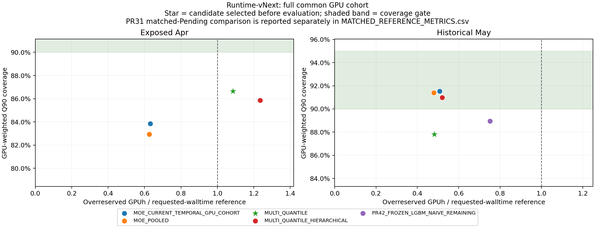

# Runtime-vNext 정량 검토 보충

평가 전 고정 후보는 **MULTI_QUANTILE**, 시간 정책은 **180일·14일 반감기**다. 평가 결과로 선택을 바꾸지 않았다.

## 전체 모델 비교

PR31 frozen reference는 Pending 교집합만 포함하므로 N이 다르다. 직접 paired 비교는 아래 matched 표와 CI를 사용한다. May frozen LightGBM의 Running 값은 total-minus-elapsed proxy다.

| 구간 | 모델 | N | Q90 coverage | GPU coverage | >4h under | overreserved GPUh | requested reference GPUh |
|---|---|---:|---:|---:|---:|---:|---:|
| Exposed Apr | MOE_CURRENT_TEMPORAL_GPU_COHORT | 9219 | 88.24% | 83.84% | 17.69% | 146,350.3 | 231,793.4 |
| Exposed Apr | MOE_POOLED | 9219 | 87.97% | 82.94% | 18.09% | 144,959.5 | 231,793.4 |
| Exposed Apr | MULTI_QUANTILE | 9219 | 87.18% | 86.64% | 17.80% | 251,443.9 | 231,793.4 |
| Exposed Apr | MULTI_QUANTILE_HIERARCHICAL | 9219 | 90.31% | 85.86% | 14.57% | 286,092.5 | 231,793.4 |
| Exposed Apr | PR31_FROZEN_MOE | 2713 | 34.32% | 38.65% | 98.94% | 3,410.3 | 52,182.6 |
| May | MOE_CURRENT_TEMPORAL_GPU_COHORT | 47492 | 91.06% | 91.53% | 21.48% | 1,256,182.8 | 2,474,000.1 |
| May | MOE_POOLED | 47492 | 90.99% | 91.40% | 21.65% | 1,185,972.0 | 2,474,000.1 |
| May | MULTI_QUANTILE | 47492 | 85.58% | 87.81% | 27.39% | 1,194,291.6 | 2,474,000.1 |
| May | MULTI_QUANTILE_HIERARCHICAL | 47492 | 90.04% | 90.99% | 19.30% | 1,288,466.0 | 2,474,000.1 |
| May | PR42_FROZEN_LGBM_NAIVE_REMAINING | 47492 | 85.69% | 88.95% | 31.25% | 1,857,847.7 | 2,474,000.1 |

## 고정 후보: Pending / Running

| 구간 | state | N | Q90 coverage | GPU coverage | >4h under | missed GPU-slots |
|---|---|---:|---:|---:|---:|---:|
| Exposed Apr | PENDING | 6452 | 88.61% | 85.60% | 19.14% | 11,131 |
| Exposed Apr | RUNNING | 2767 | 83.85% | 88.59% | 15.83% | 8,597 |
| May | PENDING | 40419 | 86.21% | 88.72% | 31.40% | 168,563 |
| May | RUNNING | 7073 | 81.95% | 81.53% | 19.28% | 42,242 |

## Running elapsed regime

| 구간 | elapsed | N | Q90 coverage | GPU coverage | >4h under |
|---|---|---:|---:|---:|---:|
| Exposed Apr | <1h | 325 | 70.15% | 79.59% | 26.71% |
| Exposed Apr | 1-2h | 351 | 87.18% | 85.03% | 15.52% |
| Exposed Apr | 2-4h | 318 | 74.53% | 82.92% | 31.27% |
| Exposed Apr | 4-8h | 442 | 83.94% | 86.16% | 16.06% |
| Exposed Apr | >8h | 1331 | 88.50% | 91.99% | 11.50% |
| May | <1h | 684 | 85.82% | 86.04% | 26.25% |
| May | 1-2h | 732 | 67.49% | 73.06% | 36.56% |
| May | 2-4h | 1204 | 90.37% | 87.46% | 10.30% |
| May | 4-8h | 788 | 85.79% | 89.33% | 14.21% |
| May | >8h | 3665 | 80.52% | 79.20% | 19.48% |

## 고정 후보의 주요 subgroup gate 미달

사전 정의한 100개 이상 Job-issue 및 총 GPU weight 1% 이상인 hardware/state/walltime/GPU 그룹 중 coverage 88% 미만만 표시한다. 전체 strata는 원본 CSV에 보존했다.

| 구간 | stratum | value | N | Q90 coverage |
|---|---|---|---:|---:|
| Exposed Apr | hardware | H100 | 9158 | 87.25% |
| Exposed Apr | standby_state | regular_PENDING | 1163 | 76.78% |
| Exposed Apr | standby_state | regular_RUNNING | 1667 | 82.42% |
| Exposed Apr | standby_state | standby_RUNNING | 1100 | 86.00% |
| Exposed Apr | wall_bucket | 1-6h | 493 | 69.78% |
| Exposed Apr | wall_bucket | 6-24h | 3873 | 87.63% |
| Exposed Apr | wall_bucket | >72h | 713 | 79.38% |
| Exposed Apr | GPU_bucket | 2-4 | 3892 | 85.17% |
| May | hardware | H100 | 47009 | 85.61% |
| May | standby_state | regular_RUNNING | 4973 | 81.38% |
| May | standby_state | standby_PENDING | 18748 | 83.86% |
| May | standby_state | standby_RUNNING | 2100 | 83.29% |
| May | wall_bucket | 24-72h | 10206 | 76.91% |
| May | wall_bucket | 6-24h | 18333 | 83.19% |
| May | wall_bucket | >72h | 1741 | 70.42% |
| May | GPU_bucket | 5-8 | 818 | 55.38% |
| May | GPU_bucket | <=1 | 27108 | 80.30% |

## 고정 후보와 frozen reference의 paired 비교

Exposed Apr의 frozen comparison은 Pending 교집합이다. Running의 기존 production remaining 모델 재현이라고 해석하지 않는다. GPU-slot은 24시간 runtime-origin occupancy proxy다.

| 구간 | state | paired N | missed GPU-slot 감소 | 후보 pinball | reference pinball |
|---|---|---:|---:|---:|---:|
| Exposed Apr | ALL | 2713 | 85.77% | 3021.76 | 5720.89 |
| Exposed Apr | PENDING | 2713 | 85.77% | 3021.76 | 5720.89 |
| May | ALL | 47492 | -36.64% | 5295.27 | 7201.81 |
| May | PENDING | 40419 | -870.26% | 3576.95 | 2827.76 |
| May | RUNNING | 7073 | 69.14% | 15114.68 | 32197.51 |

## 효과별 paired 95% CI

7개의 관측 issue-day circular block, 2,000회 bootstrap이다. Delta는 candidate minus reference이며 음수이면 pinball 개선이다. 1일 결과도 원본 CSV에 있다. architecture 항목의 Running/ALL은 remaining-target 전략 변화도 포함한다.

| 구간 | effect | state | Delta pinball | 95% CI | unmatched candidate / reference |
|---|---|---|---:|---|---:|
| Exposed Apr | vs_frozen_production | ALL | -2699.13 | [-4406.42, -1800.56] | 6506 / 0 |
| Exposed Apr | vs_frozen_production | PENDING | -2699.13 | [-4406.42, -1800.56] | 3739 / 0 |
| Exposed Apr | temporal_same_GPU_cohort | ALL | 555.96 | [105.65, 1105.55] | 0 / 0 |
| Exposed Apr | temporal_same_GPU_cohort | PENDING | 86.28 | [-142.15, 269.67] | 0 / 0 |
| Exposed Apr | architecture_same_policy | ALL | -4956.84 | [-7208.19, -2601.56] | 0 / 0 |
| Exposed Apr | architecture_same_policy | PENDING | -3370.10 | [-5119.90, -1301.78] | 0 / 0 |
| Exposed Apr | hierarchical_calibration | ALL | 2824.34 | [1258.31, 4536.41] | 0 / 0 |
| Exposed Apr | hierarchical_calibration | PENDING | 1724.91 | [884.67, 2609.90] | 0 / 0 |
| May | vs_frozen_production | ALL | -1906.54 | [-7724.85, 953.84] | 0 / 0 |
| May | vs_frozen_production | PENDING | 749.19 | [-616.04, 1853.28] | 0 / 0 |
| May | vs_frozen_production | RUNNING | -17082.83 | [-40706.02, -2689.78] | 0 / 0 |
| May | temporal_same_GPU_cohort | ALL | -11.35 | [-42.44, 34.72] | 0 / 0 |
| May | temporal_same_GPU_cohort | PENDING | -14.60 | [-75.54, 2.58] | 0 / 0 |
| May | architecture_same_policy | ALL | -5691.48 | [-9961.63, -3008.97] | 0 / 0 |
| May | architecture_same_policy | PENDING | -1985.06 | [-3179.78, -136.34] | 0 / 0 |
| May | hierarchical_calibration | ALL | 574.23 | [308.97, 1032.42] | 0 / 0 |
| May | hierarchical_calibration | PENDING | 202.51 | [49.66, 499.90] | 0 / 0 |

## Calibration 이전 Pending point architecture 비교

같은 시간 정책·cohort·입력·OHE/SVD·total-runtime target에서 raw MoE point와 raw LightGBM Q50을 비교한다. Q90 pooled correction의 영향은 들어가지 않는다.

| 구간 | LGBM Q50 MAE(s) | MoE point MAE(s) | Delta | 7-issue 95% CI |
|---|---:|---:|---:|---|
| Exposed Apr | 17402.34 | 16816.87 | 585.47 | [-989.62, 1798.98] |
| May | 10531.31 | 10595.46 | -64.15 | [-1133.62, 194.71] |

## Q95/Q99 진단

선택과 gate는 Q90 기준이다. 아래 상위 quantile의 coverage를 Q90 성과로 대체하지 않는다. 모든 모델·quantile의 결과는 QUANTILE_DIAGNOSTICS.csv에 있다.

| 구간 | state | quantile | coverage | GPU coverage | overreserved GPUh |
|---|---|---:|---:|---:|---:|
| Exposed Apr | PENDING | 0.90 | 88.61% | 85.60% | 81,702.5 |
| Exposed Apr | PENDING | 0.95 | 92.33% | 90.24% | 130,778.9 |
| Exposed Apr | PENDING | 0.99 | 95.23% | 94.05% | 165,289.1 |
| Exposed Apr | RUNNING | 0.90 | 83.85% | 88.59% | 169,741.4 |
| Exposed Apr | RUNNING | 0.95 | 90.78% | 93.14% | 205,558.1 |
| Exposed Apr | RUNNING | 0.99 | 98.88% | 99.31% | 251,122.1 |
| May | PENDING | 0.90 | 86.21% | 88.72% | 913,441.2 |
| May | PENDING | 0.95 | 92.80% | 93.83% | 1,312,236.7 |
| May | PENDING | 0.99 | 98.99% | 98.39% | 1,741,649.0 |
| May | RUNNING | 0.90 | 81.95% | 81.53% | 280,850.4 |
| May | RUNNING | 0.95 | 91.22% | 89.49% | 333,653.8 |
| May | RUNNING | 0.99 | 96.59% | 96.21% | 427,632.0 |

## 기준선·인과성·적용 범위

과거 MoE 재학습의 245개 예측, 최신 LightGBM 31일분 frozen 예측 및 대표 issue 재학습을 검증했다. 최신 대표 issue는 완료 Job 667,375개, Pending 1,395개이며 model text SHA-256까지 완전히 같다. May 31일 training membership도 frozen authority와 모두 일치한다.

Temporal 효과는 공통 positive-GPU cohort에서만 식별한다. 과거 전체 Job MoE의 production refit 우월성으로 확대하지 않는다. request 수정 이력과 실제 ingestion 시각은 미인증이며, target/interface 유효성은 offline event-time proxy 범위다. 완료 Job만 학습하는 remaining 모델의 completion selection bias 및 장기 반복 Job의 dependence는 남는다.

## 최종 해석

고정 후보는 전체 success gate를 통과하지 못했다. May의 frozen baseline 대비 전체 Q90 pinball 차이는 7-issue CI가 0을 포함한다. Running의 naive total-minus-elapsed 기준선 대비 개선은 있지만, Pending에서 missed GPU-slot이 증가해 전체 50% 감소 조건을 충족하지 못한다. Running-only 개선을 전체 운영 우월성으로 해석하지 않는다.

Hierarchical calibration challenger는 May 전체 coverage와 GPU coverage를 목표 범위로 올렸지만 long-job underprediction 조건은 통과하지 못했다. evaluation 결과를 보고 이 challenger로 재선택하지 않았다. 공통 시간 정책의 Q90 비교는 quantile 추정 방식과 pooled correction 차이를 함께 포함하며, calibration 이전 Pending point MAE의 architecture 차이는 두 평가 구간 모두 CI가 0을 포함한다.

통계적으로 견고한 production 대체 개선, production replacement 및 optimizer integration readiness는 지지하지 않는다. 모든 비교의 N과 N_days는 실제 paired 관측으로 계산한다. May Pending은 31개 issue 중 Pending 관측이 있는 29개 issue이며, 빈 issue를 결과에 따라 제외한 것이 아니다.

상세 비교의 해석은 [INTERPRETATION_CONTRACT.md](INTERPRETATION_CONTRACT.md)를 따른다. 기존 frozen evidence와 optimizer/MESS/IEEE123/8500/Actual/OpenDSS는 변경하거나 실행하지 않았다. production promotion과 optimizer integration은 수행하지 않았다.

