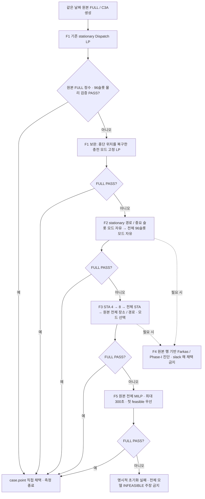

# V42 B2 V19 — 종단 상태 버그 수정과 초기해 생성

V18의 `values_for()`는 0~95 슬롯의 연결 상태만 만들고, 원본 C3A의 96번 종단 `node_activity`를 기본값 0으로 고정했습니다. May03의 네 fallback 후보 모두에서 차량별 `terminal_location` 행은 정확히 `0 = 1`이 됩니다. 원본 모델의 불가능성이 아니라 후보 생성기의 오류입니다.

[MAY03_ROOT_CAUSE_PROOF.json](MAY03_ROOT_CAUSE_PROOF.json)에 원본 matrix/domain SHA, 16개 정확 유리수 모순, 수정 전후의 종단 변수와 Native IIS 4개를 보존했습니다. 최초 stationary LP는 이 버그가 없는 별도 함수이며 120초 종료였습니다. 그 시간 초과의 원인을 종단 버그로 잘못 설명하지 않습니다.

## 초기화 절차

- 수정한 고정 패턴은 마지막 원본 arc의 실제 도착 장소에 96번 종단 상태를 설정합니다. 초기 장소로 돌아오는 제약을 새로 추가하지 않습니다.
- 모든 초기화 LP/MILP는 원본 전체 행을 유지합니다. F2/F3의 경로·모드 제한과 보조 목적함수는 초기해 탐색 모델에만 적용합니다.
- F5는 모든 원본 bounds/type/objective를 복원합니다. MIPGap=0.03, MIPFocus=1, SolutionLimit=1, 요청 최대 300초입니다.
- 시험의 초기화 합산 Native 상한은 1,500초입니다. 종료 오버헤드도 실제 Runtime으로 기록합니다. 날짜 캠페인 5,400초 예산과 별개입니다.
- 첫 FULL 통과 point를 `case.point`로 넘기는 계약을 유지합니다. 실제 벤치마크는 LB/Adaptive를 실행하지 않습니다. 별도 운영 어댑터는 기존 V18의 동결된 후속 파이프라인을 호출하며 초기화 실패 후 중복 900초 seed 호출을 금지합니다.

## 진단과 초기화의 구분

네 고정 후보의 진단은 이전 시도의 원본 C3A SHA를 확인하고 수행했습니다. 전체 proof LP가 시간 제한에 걸려, 원본 행의 진단 전용 부분계와 원본 singleton 행이 함의하는 고정값 대입으로 IIS를 추출했습니다. 이 부분계의 어떤 point도 초기해 생성기에 전달하지 않습니다. 초기화 모델의 행은 삭제하지 않습니다.

Farkas 진단 LP 네 시도는 각각 별도 root/attempt/source SHA로 보존되어 있습니다. 마지막 시도는 Native IIS 4/4를 얻었습니다. IIS 자체는 최적화 Runtime 속성으로 회계할 수 없으므로 별도 wall과 Native UNKNOWN으로 보고합니다. 최적화 Runtime을 중복 합산하거나 UNKNOWN을 0으로 바꾸지 않습니다.

## 실행과 검증 자료

- [V18R2 May03 안전 중단](V18R2_MAY03_STOP_RESULT.json)
- [실패 원인의 원본 행 증명](MAY03_ROOT_CAUSE_PROOF.json)
- 최종 실제 May03/04 성능, FULL 검증, 원본 SHA와 Q1~Q10은 `FINAL_REVIEW_KO.md`에 기록합니다.
- 공식 캠페인 결과·B0/B1·V17·V18R2는 보존합니다. May02를 재실행하지 않습니다.
- 실행 코드와 결과는 별도 V19 branch/source SHA/attempt로 구분합니다. 초기해 이후 Adaptive/UB/LB/Pricing/RMP 소스는 수정하지 않습니다.
