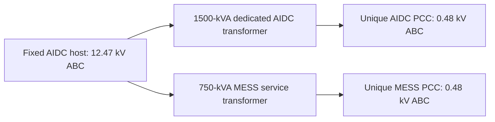

# IEEE8500 additive PCC overlay — structural validation

**PASS_IEEE8500_ADDITIVE_PCC_OVERLAY_ZERO_INJECTION_STRUCTURAL_VALIDATION**

기존 AIDC v3 및 station_selection_v1의 24-location registry를 FINAL immutable topology authority로 기록했다. Host와 선정 규칙 변경은 금지되며 이번 변경 수는 0이다. 새 PCC overlay만 이 별도 workspace에 생성했다.

## 추가한 구성

| PCC role | Count | 각 transformer kVA | 전압 LL | 접속 |
|---|---:|---:|---|---|
| Dedicated AIDC PCC | 12 | 1,500 | 12.47 / 0.48 kV | 3-phase wye–wye |
| MESS service PCC (AIDC+STA) | 24 | 750 | 12.47 / 0.48 kV | 3-phase wye–wye |

모든 PCC는 서로 다른 LV bus를 가지며 기존 primary host의 직접 leaf branch이다. AIDC host 12개에는 AIDC PCC와 MESS PCC 두 branch가 공존한다. 이 의도적 primary-host 공유 외의 중복 service host/PCC bus/transformer 이름은 0이다. STA host 12개에는 MESS PCC 한 개씩만 있다.

Load, Generator, Storage, PVSystem, PCS 또는 GPU/energy 자원을 생성하지 않았다. PCC 버스만 준비했으며 AIDC/MESS PCS·GPU·energy scale은 수정하지 않았다. 750-kVA transformer 정격을 PCS 정격으로 재정의하지 않는다.

## V41R4 static PCC 사양 적용

정적 참조는 현재 V41R4 checkout에 보관된 `dayahead/artifacts/v16_2/Generated_ThreePhase_PCC_v4.dss`이며 SHA256은 `ba13e3081df606c18d61f1e02300b23f7be00dc2d22bc4c8064d04f40beec719`이다. 연결된 정적 PCC contract의 asset hash와 일치했다. 참조의 transformer block 36개를 확인했고 요청하신 12×1500 및 24×750 kVA를 적용했다. V41R4/May performance 결과는 읽지 않았다.

기존 참조의 4.16-kV primary는 IEEE8500의 고정 12.47-kV host에 맞춰 **12.47 kV**로 변경했다. Secondary 0.48 kV, XHL=5.75%, wye–wye, %NoLoadLoss=0, %Imag=0 및 정격은 유지했다. 참조의 단일 `%R=0.8`은 엔진에서 winding %Rs=[0.8,0.2]로 해석되므로 overlay에는 이 배열을 명시했다. 두 winding 모두 0.8%로 바꾸지 않았다. Reference default normal/emergency kVA는 nameplate의 1.1/1.5배로 동일하게 확인했다. Nominal nameplate는 각각 1500/750 kVA이다.

이는 IEEE8500 case-study interface adaptation이며 실제 Melbourne 설비 명판이나 현재 운영 성능을 입증하는 자료가 아니다.

## Compile 및 count 감사

| 항목 | Native | PCC overlay |
|---|---:|---:|
| Buses | 4876 | 4912 |
| Electrical nodes | 8531 | 8639 |
| Transformers | 1190 | 1226 |
| Total circuit elements | 7280 | 7316 |
| Lines | 3,703 | 3,703 |
| Native loads | 2,354 | 2,354 |
| Capacitors / RegControls / CapControls | 10 / 12 / 9 | 10 / 12 / 9 |

새로운 36 buses의 nodes는 모두 [1,2,3]이다. Overlay bus base 분포는 sqrt(3)×LN 기준 115 kV 2개, 12.47 kV 2520개, 0.208 kV 2354개, **0.48 kV 36개**다. 기존 0.208 base는 native center-tapped split-phase model의 engine base 표기이며 3상 208-V 부하라고 재해석하지 않는다. Native base list는 이미 0.48 kV를 포함하므로 변경하지 않았다.

Engine: `DSS C-API Library version 0.14.5 revision 87d85c2622c8281b92255335bc7c09b11191b21d based on OpenDSS SVN 3723 [FPC 3.2.2] (64-bit build) MVMULT INCREMENTAL_Y CONTEXT_API PM 20240329033747; License Status: Open  / DSS-Python version: 0.15.7 / OpenDSSDirect.py version: 0.9.4`. Native source와 wrapper 모두 compile error=0. 새 36 leaf corridor를 더한 집계 graph는 4912 vertices /4911 unique corridors, cycle rank=0이다. 모든 7280 native elements의 적용 가능한 static definition, terminal, phase, enabled state를 baseline과 비교해 변경 0개를 확인했다. Line/transformer impedance와 ratings, regulator/capacitor definitions도 그대로다.

정의 비교에서 Transformer.WdgCurrents는 입력이 아닌 계산 출력이므로 제외했다. Scalar R/X reactor 및 kV/kvar capacitor에서 사용되지 않는 matrix getter가 현재 C-API에서 불안정한 값을 반환하므로 그 비활성 matrix representation 대신 실제 scalar 정의를 비교했다. 이 범위와 이유는 NATIVE_DEFINITION_COMPARISON.json에 명시했다.

## No-load / zero-external-injection validation

Baseline 및 overlay의 별도 engine context에서 각 1회, 총 2회의 무부하 구조 solve를 수행했고 모두 수렴했다. Native PC load/generator/storage 계열은 **검증 context 안에서만 enabled=False**로 격리하고 control mode를 off로 두었다. LoadMult 변경이나 background scaling은 하지 않았다. Native capacitor shunts, native transformer magnetizing/no-load branches, tap/ratings는 유지했다. 검증 뒤 enabled states/control mode를 모두 복원하고 model definitions가 원래와 동일함을 재확인했다.

‘zero injection’은 외부 PC power injection이 0이라는 의미다. Native capacitive/magnetizing branches 및 reference 기본 anti-float admittance 때문에 total source power가 수학적으로 0이라는 주장은 하지 않는다. 새 PCC에는 power injection 객체가 전혀 없다.

각 PCC transformer의 terminal NodeOrder=[1,2,3,0,1,2,3,0]를 확인했다. Primary와 secondary의 복소 전압비를 모든 상에서 0.48/12.47과 비교했으며 최대 상대오차는 **2.91815429245e-08**로 structural tolerance 1e-4 이내이다. 이것은 상 연결과 ratio 검사이며 부하 운전 전압/thermal hosting-capacity 승인이 아니다.

## 파일과 불변성

- `Master_IEEE8500_PCC.dss`: 기존 native master를 absolute path로 compile하고 additive overlay/좌표만 redirect한다. 현재 D: workspace 경로를 사용한다.
- `IEEE8500_PCC_Overlay.dss`: 36 transformer definitions만 포함한다.
- `PCC_OVERLAY_INVENTORY.csv`: 24 hosts→36 transformers→36 PCC bus mapping.
- `PCC_GENERATED_TRANSFORMER_AUDIT.csv`: 정격·winding·접속 사양.
- `PCC_ZERO_INJECTION_PHASE_VALIDATION.csv`: 36 PCC의 no-load phase/ratio 검사.
- `FINAL_IMMUTABLE_TOPOLOGY_AUTHORITY.json`: 고정 host와 상위 authority hashes.
- `PCC_OVERLAY_FREEZE_MANIFEST.json`: overlay 및 감사 산출물 SHA256.

원본 IEEE8500 source와 모든 topology-selection evidence **2019개 파일**의 내용/크기/mtime이 작업 전후 일치했다. 기존 workspace에 추가/삭제된 파일도 0개다. V41R4 static reference도 변경하지 않았다. 새 산출물은 이 workspace에만 있다.

Melbourne background temporalization, alpha8500 selection, AIDC load injection 및 B0–B3 실행은 모두 0회다.
